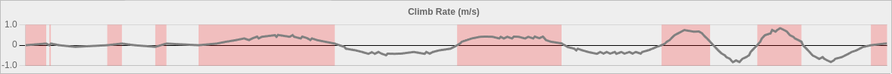
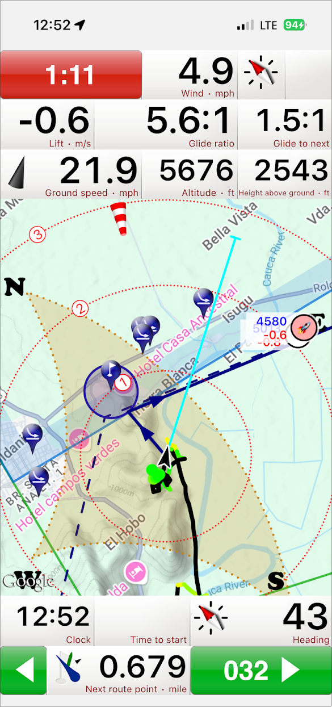

A few months ago, I saw James post in our SF Bay area social paragliding group about an [open source vario he's developing](https://github.com/DangerMonkeys/leaf).
A few weeks later, I lost my vario somewhere in the sands of Palo Buque so became interested in the project.

With the offer to help out here and there, James sent me a Leaf to try, and, first impressions were that this was surprisingly
complete!  I took it to Colombia and used it as my primary vario, and the little device did not disappoint.

I've now spent more than a little bit of time working on the little device, so this post is going to be a writeup on some of
workings on the project, and some direction I'd like to be able to take it in.

Some of the improvements I've made to the project so far:

### Easier Updating over WiFi

One of the biggest concerns James had of getting this out into the hands of more people who are less technical, is how hard
it is to update the software on it.  I took learnings from my chess board to enabled PlatformIO, 
[and support WiFi on the ESP32](https://github.com/DangerMonkeys/leaf/commit/47e0c28cac5e303f6f4cf75ab1a86d8cd76920e1).

I used both the [WifiManager](https://registry.platformio.org/libraries/wnatth3/WiFiManager) library to host a captive portal for setup, as well as the setup by the Espressif "SmartConfig".  While SmartConfig I hate the security implications (your password is encoded in varying length frames and broadcast out for the world to see).  It's so simple.  Simple QR codes are used to link to the appropriate app too.

### Updating over Mass Storage

I like how the Rp2040 and nRF52 style devices enable easy updates by just exposing a mass storage device.  
[This commit](https://github.com/DangerMonkeys/leaf/commit/dc2d757512a6208672a9765290364763da4cb946) added in the ability
to expose the SD card as a mass storage device, as well as enable the Mass Storage firmware updater, so it shows up as a
device.

### IGC Logging

When I'm flying, I often find the track logs have big jumps in them with my Flyshyhy recording, so, would love to have the 
recordings on my vario from presumably more accurate sensors (or at least sensors driven more real time.)

There was already kml file recordings, but, the world of paragliding seems to have standardized on igc files here.

This was fairly fun as I got to do my first [Arduino / PlatformIO library](https://github.com/scottyob/IgcLogger)
then [incorporate it in the Leaf project](https://github.com/DangerMonkeys/leaf/commit/e6de241b43548cfa34d0c2f1b98be1d7fc715650)

### Telemetry & Climb Rate Detection

The biggest gripe I have with the project today, is how slow it seems to respond.  When flying in Colombia, I could tell I was
in a climb, and I then waited to get audible feedback from the vario as a proof.  They should really be in lockstep with each other,
or in cheat mode, have my vario tell me when I'm in a weak climb before I myself can tell.

Currently, the binary telemetry file logging is [in a pull request](https://github.com/DangerMonkeys/leaf/pull/61).

I [wrote a web tool](https://github.com/scottyob/leaf-telemetry-viewer) to view the telemetry and my findings were somewhat interesting.

In a test, I moved the vario up slow twice, and faster twice.  I colored "positive climb rate" as detected by the vario with red.  
If we just look at the climb rate and barometers pressure altitude, we can see two things of interest:

*climb rate is always smooth*

The climb rate as shown above is always smoothed out.  The [averaging algorithm used](https://github.com/DangerMonkeys/leaf/blob/75566830360d0d239912237f00e1521dd21a254c/src/vario/baro.cpp#L415-L429)
has a number of poor side effects:
* Once we're in a climb, we need to wait for enough data points to be climbing before the climb rate will respond.
* Once we leave a climb and am now descending, out climb rate will still be seen as positive until we have enough data points
* During the start of a decent, for a time, our climb rate will keep showing positive, just at a lesser rate.  This is terrible
  for a paraglider, as, if we fall out of a thermal, it will give false positive information to the pilot!

This can be seen clearly when looking at the altitude with the climb rate highlighted

*Climbs are delayed from changes in altitude*

# Moving Forward

There's still a bit of word left I'd like to do on the project before I'll be truly happy with it as much as I would with a more expensive commercial product:

## Better Climb Rate Algorithm

A friend, Rob is helping with this, so I won't devote too much time and energy here, but, I want to learn more about how Kalman filter's work, so would love to implement one of those on this climb.

This will be a new post all on its own.

## FANET

When flying in Colombia, we used XContest live tracking to help team fly, keep track of where our friends are at.  I used Emoji's
for initials to do this.

This became very frustrating, and once again gave false positive information to me as the pilot when cellular was poor here though.  I believe
using cheap radios in the vario, we can work around this.

Fanet is an open protocol that we could plug in to help with this!  I *think* I've convinced James to add a SX1262 radio on board, and I've
found that much of the protocol is already incorporated in [GXAirCom](https://github.com/gereic/GXAirCom).  I need to make sure that
without a license, I can use the libraries written in this project though.  I may even pull them out into their own Arduino library!

I can see a world where we make use of the features in the FLARM protocol spec to flag "landed safe", "need a ride", "picked up ok" to help
with comp days too and give a faster feedback loop than our current satellite comms!
