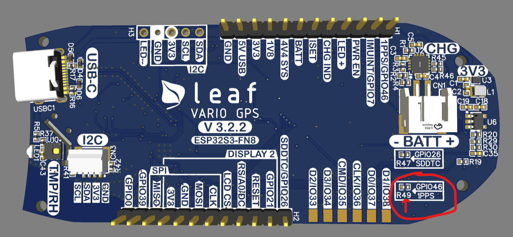
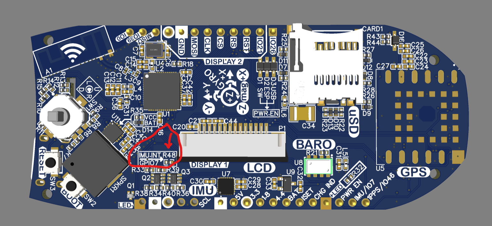

From my [Previous Post](/post/2025-02-08-leaf-vario/), I mentioned one of the things I wanted to have working was Fanet.

This post is the first in a series of how I'm implementing Fanet into the Leaf and covers setting up my hardware testbed to send and receive LoRa frames using the Leaf.

{/* --- */}


## Selecting Hardware

I'll be testing with the Lilygo T-Echo running SortRF.  The [SortRF compatibility note](https://github.com/lyusupov/SoftRF/wiki/FANET-compatibility) mentions that Skytraxx module uses the SX12xx family of chips.

As it seems there are a bunch of projects out there using it, we're running with the SX1262 chip, but it also looks like a newer Lr1121 is an option.  There's probably more FCC certified Sx1262 options out there though.

In our Leaf, we're looking at using the [Seeed Studio Xio-SX1262](https://files.seeedstudio.com/products/SenseCAP/Wio_SX1262/Wio-SX1262_Module_Datasheet.pdf) due to it being FCC certified.  To get something that will run on a breadboard, I'm testing using the [Waveshare Core1262](https://www.waveshare.com/core1262-868m.htm).  Same chip, but some differences.


## Preparing the Hardware

James had given me some older revision boards that are going to be perfect for testing on.  They have a lot of their IO broken out around the edges that fits nicely on a breadboard.

As there's not enough free GPIO pins, for this purpose I removed the 0ohm resistors to the GPS 1pps and IMU interrupt pins.


*Location of 1pps 0ohm resistor*


*Location of interrupt 0ohm resistor*

The Waveshare SX1262 module was hooked up to the SPI pins.  

```c++
#define SPI_MOSI 11
#define SPI_CLK 12
#define SPI_MISO 13
```

One of the biggest differences in the two modules is Seeed studio has a single "RF_SW", and our Waveshare has both a RX and TX enable.

To get the same functionality out of the WaveShare chip, we jumpered the DIO2 pin to TX enable, and setup the radio like this.

```c++
#define LORA_PIN_LORA_RESET 39     // LORA RESET
#define LORA_PIN_LORA_DIO_1 46     // LORA DIO_1
#define LORA_PIN_LORA_BUSY 7       // LORA BUSY
#define LORA_PIN_LORA_NSS 0        // LORA SPI CS
#define LORA_RADIO_RXEN 21         // LORA ANTENNA RX ENABLE
#define LORA_DIO2_ANT_SWITCH true  // We use DIO2 as an antenna switch

SX1262 radio = new Module((uint32_t)LORA_PIN_LORA_NSS,
                          (uint32_t)LORA_PIN_LORA_DIO_1,
                          (uint32_t)LORA_PIN_LORA_RESET,
                          (uint32_t)LORA_PIN_LORA_BUSY);
```

## The Software

Below is the full demo sketch, using the [RadioLib library](https://github.com/jgromes/RadioLib) (same as Meshtastic) where I can test that
I can at lease see Meshtastic long-fast frames using their given settings:

```
[SX1262] Received packet!
[SX1262] Data:          ����!�/./c
[SX1262] RSSI:          -35.00 dBm
[SX1262] SNR:           5.75 dB
[SX1262] Frequency error:       -595.78 Hz
```

<script src="https://gist.github.com/scottyob/d3489ca90bf535ed942dc1649c7840a7.js"></script>
