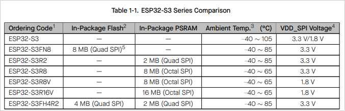
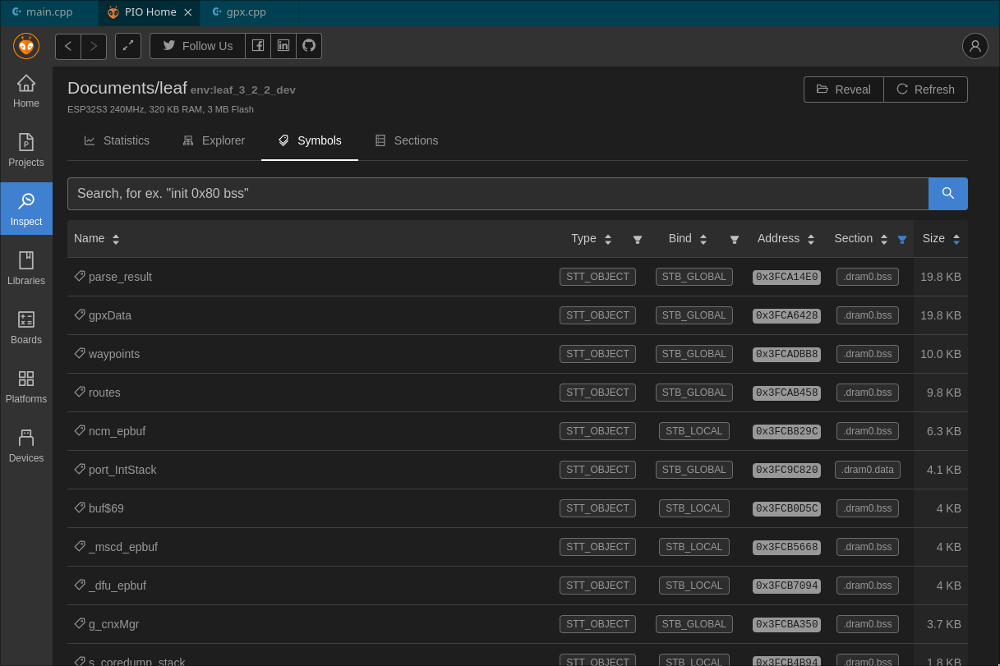
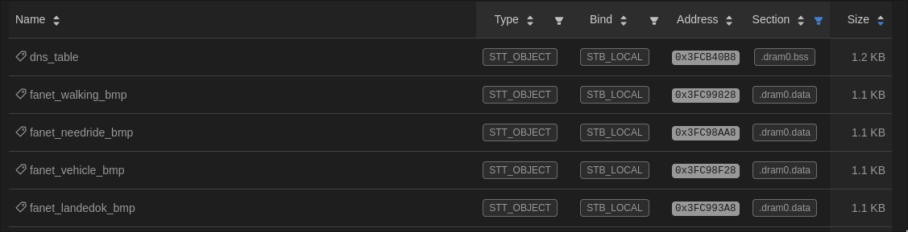

Imagine this, you're working away on a codebase, adding new feature after new feature, then suddenly your board
starts crashing and you get malloc failures.  You've just reached an inflection point where you never used to 
have to worry about memory usage, to now being worried about the general stability of the device 😟  

{/* --- */}

That's where we just found ourselves as part of the [Leaf](http://leafvario.com)'s development today.  After removing
the lines that crashed, and adding in some debug lines in a loop, I'm found with the following:

```
Total heap: 215476
Free heap: 1104
Total PSRAM: 0
Free PSRAM: 0
```

So now this blog post will be written as I try to document my findings for questions like:

* Why do I only have 215 KB of heap memory total?  
* Why do I only have ~1KB Free?  
* Where did it all go!?!?!?


## Understanding the ESP32 Memory

We're using the "ESP32-S3(FN8)" family of chips.  From the [datasheet](https://www.espressif.com/sites/default/files/documentation/esp32-s3_datasheet_en.pdf)
we can see the capability of our chip 


*ESP32 Capability Datasheet*

Our particular chip has 8MB of Flash, but, sadly no PSRAM to use.  Meaning we're left with 520KB of RAM.  

As a reference, I'm using both the [ESP32 Programmer Memory Model](https://developer.espressif.com/blog/esp32-programmers-memory-model/)
blog post, and the [Memory Type API Guide](https://docs.espressif.com/projects/esp-idf/en/latest/esp32/api-guides/memory-types.html#memory-types).  Before
we start digging into the memory layout, let's go over some terms as found in in these documents:

### Key Terms

* **Flash**: Non-Volatile memory where code and settings can be saved.
* **SRAM**: Static Random-Access Memory.  Entire available to store and retrieve data.
* **.text**: Read-only section that contains executable instructions.
* **.rodata**: Read-only section for constant data (numerical constants, strings, etc)
* **.data**: data able to be modified at runtime, statically initialized global, and local variables with default value
* **.bss**: contains data that can be modified by the application at runtime (statically initialized global and local variables without the default value). Usually, the system initializes this data with zeros before the program begins to run.


### Memory Breakdown

So let's start breaking down this 520KB of memory usage and how it's allocated.  The ESP32 has SRAM divided into three blocks, used
to hold IRAM and DRAM.  

import Memory from "./memory.astro"

<Memory />

The limitations here at that while SRAM1 can be used for both IRAM and DRAM, only SRAM0 can be used for IRAM, and SRAM2 for DRAM.

#### IRAM

My understanding here is that IRAM is mostly used for code execution.  For parts of the code that need to be stored in memory
for efficient processing.  The only place in the Leaf codebase I know we're explicitely using this IRAM memory is to store
functions that are used for an Interrupt Service Routine (ISR).  To set flags or callbacks when a pin goes Low or High.

#### DRAM

Non-constant static data (.data) and zero-initialized data (.bss) is placed by the linker into Internal SRAM as data memory. 
The remaining space in this region is used for the runtime heap.

## Measuring BLE and WiFi Memory Usage

Building a [sketch of one of the most basic Arduino programs](https://gist.github.com/scottyob/33991f2381b088f9421ecab43d2643ce)
 we can muster, we can start to play with how much RAM is typically free on the heap when we're not doing anything useful.

```
=== Memory Stats ===
Total Heap: 390484 bytes
Free Heap: 352776 bytes
Used Heap: 37708 bytes
Largest Free Block: 286708 bytes
Minimum Free Heap Ever: 348708 bytes
Main Task Stack Size: 12392 bytes
Main Task Stack High Water Mark: 6196 bytes
Free PSRAM: 0 bytes
Largest Free PSRAM Block: 0 bytes
====================
```

So we can see we have ~38KB used on the heap.  ~390 KB allocated to the heap, of which ~353 KB is free, with ~12 KB being used for the stack.

Once we add in WiFi:
```
=== Memory Stats ===
Total Heap: 359908 bytes
Free Heap: 263344 bytes
Used Heap: 96564 bytes
Largest Free Block: 196596 bytes
Minimum Free Heap Ever: 260384 bytes
Main Task Stack Size: 11136 bytes
Main Task Stack High Water Mark: 5568 bytes
Free PSRAM: 0 bytes
Largest Free PSRAM Block: 0 bytes
WiFi: 10.11.1.57
====================
```

Used goes up to ~96.5 KB.  About 58KB increase for the cost of just connecting to WiFi.  What about BLE?

```
=== Memory Stats ===
Total Heap: 320140 bytes
Free Heap: 148372 bytes
Used Heap: 171768 bytes
Largest Free Block: 86004 bytes
Minimum Free Heap Ever: 145892 bytes
Main Task Stack High Water Mark: 5512 bytes
Free PSRAM: 0 bytes
Largest Free PSRAM Block: 0 bytes
10.11.1.57
====================
```

And adding in [some basic BLE program](https://gist.github.com/scottyob/bb35ccc4771b44efb5a5f165689eece5), 
we now see an increase of ~ 75.5 KB.  Totalling ~172KB of Used now!

So the cost of running in this ecosystem and adding in BLE and WiFi we can tell:
* We have ~ 353 KB of memory free doing nothing
* Adding in simple BLE and WiFi takes us down to 148 KB.
* The cost of Bluetooth and WiFi is about 205 KB, by far our biggest offenders.

## Offline Profiling

Remember those .data and .bss terms?  Things that are globally stored in RAM and will reduce our available
stack size?  We can use the PlatformIO inspector tools to start getting an idea about what's allocated
there.  The cost of this is pretty big too!


*Cost of GPS & Routes is 59.4 KB*

There was also a lot of images added, without the const keyword.  The compiler wasn't smart enough to realize
this should be left in flash, so it's also copied ~4.4KB of graphics to memory too 


*4.4 KB of memory used by images*

## Recent Fanet Changes

The [Fanet library](https://github.com/scottyob/fanet-plus/blob/main/src/fanetManager.h) I've been playing with 
has a queue of 20 packets.  Each of these is at least 256 bytes (though much more, because I store the unencoded 
values for quicker getting/setting).  I know this is done on the heap, so that's at least 5.1 KB of memory.

Fanet Manager Size: 13,728
Doing a sizeof() on it, shows that my Fanet Manager library itself is currently using 13.7 KB of RAM when in
use.  This is also not accounting for any resources the underlying radio libraries use.

## Summary

I'd still like to find a better way of profiling this, and come back and modify this with more findings, but 
as you can tell from our initial ~350KB of Free memory, well, it goes fast!