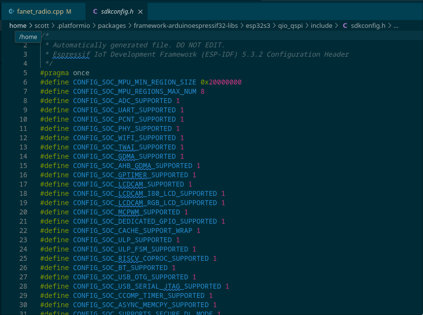

When introducing threads and Mutex into our [Leaf](http://leafvario.com/) project, I'd introduced a deadlock.  One
that was super challenging to find by trying to think through the code.  This is a writeup about how I used
the Espressif IDF framework to troubleshoot my PlatformIO ESP32 Project.

{/* --- */}

## Generating a Coredumps

The Arduino PlatformIO is basically the Espressif IDF framework in the back, with some less flexible, but generally
sane defaults.  The idea is that we can modify our lock guard to give up after 30 seconds, and throw an exception
to generate a core dump so we can investigate the stack trace of all the threads.

Our platformIO file has the following lines:
```
[env]
platform = https://github.com/pioarduino/platform-espressif32/releases/download/stable/platform-espressif32.zip
board = esp32-s3-devkitc-1
framework = arduino
board_upload.flash_size = 8MB

# ~3.2Mb for A and B partitions to allow for updates
board_build.partitions = default_8MB.csv
```

This default_8MB.csv partition looks [like this](https://raw.githubusercontent.com/espressif/arduino-esp32/refs/heads/master/tools/partitions/default_8MB.csv)
```csv
# Name,   Type, SubType, Offset,  Size, Flags
nvs,      data, nvs,     0x9000,  0x5000,
otadata,  data, ota,     0xe000,  0x2000,
app0,     app,  ota_0,   0x10000, 0x330000,
app1,     app,  ota_1,   0x340000,0x330000,
spiffs,   data, spiffs,  0x670000,0x180000,
coredump, data, coredump,0x7F0000,0x10000,
```

The things to note here is the "coredump" partition defined with the coredump type in flash memory.

If we look deep into the core libraries, we can see a "sdkconfig.h" file with all of the FreeRTOS settings that would
usually be configured using the "menuconfig" ESP-IDF settings.


*Generated SDKConfig Options*

In here, we can tell that core dumping to flash is definitely enabled by default!

```
...
#define CONFIG_ESP_COREDUMP_ENABLE_TO_FLASH 1
#define CONFIG_ESP_COREDUMP_DATA_FORMAT_ELF 1
#define CONFIG_ESP_COREDUMP_CHECKSUM_CRC32 1
#define CONFIG_ESP_COREDUMP_CHECK_BOOT 1
#define CONFIG_ESP_COREDUMP_ENABLE 1
#define CONFIG_ESP_COREDUMP_LOGS 1
#define CONFIG_ESP_COREDUMP_MAX_TASKS_NUM 64
#define CONFIG_ESP_COREDUMP_USE_STACK_SIZE 1
#define CONFIG_ESP_COREDUMP_STACK_SIZE 1792
...
```

I found I could download the coredump using a 'pio pkg exec -p "tool-esptoolpy" -- esptool.py' 
command, but, that's as far as I got without using the ESP-IDF tooling.

## Installing ESP-IDF

I found stepping outside of the PlatformIO ecosystem and installing ESP-IDF the easiest way 
to access the tooling to download and parse these coredumps.

The [installation guide](https://docs.espressif.com/projects/esp-idf/en/stable/esp32/get-started/linux-macos-setup.html) 
has some setup instructions. Once the deps are installed:

```
git clone -b v5.2.5 --recursive https://github.com/espressif/esp-idf.git esp-idf
cd esp-idf
./install.sh esp32s3
```


## Parsing a coredump

You'll want to run the "export.sh" script (if bash) to setup the esp-idf environment variables first.  Then
we can point to the PIO built firmware.elf file.

In the dump below, we can tell that at the time of the crash, both the FanetRX, FanetTX, and the mainLoop's display
functions were all taking out GuardLocks.  A great place to start :)

```
. ./export.sh 
[scott@sob-desktop esp-idf]$ espcoredump.py -p /dev/ttyACM0 info_corefile ~/local-scott/Documents/leaf/.pio/build/leaf_3_2_5_dev/firmware.elf 
WARNING: /home/scott/local-scott/Documents/leaf/.pio/build/leaf_3_2_5_dev/project_description.json does not exist. Please build the app with "idf.py build"
INFO: Invoke esptool to read image.
INFO: Retrieving core dump partition offset and size...
Traceback (most recent call last):
  File "/homes-local/scott/Documents/Others/esp-idf/components/partition_table/parttool.py", line 363, in <module>
    main()
    ~~~~^^
  File "/homes-local/scott/Documents/Others/esp-idf/components/partition_table/parttool.py", line 332, in main
    target = ParttoolTarget(**target_args)
  File "/homes-local/scott/Documents/Others/esp-idf/components/partition_table/parttool.py", line 103, in __init__
    self._call_esptool(['read_flash', str(partition_table_offset), str(gen.MAX_PARTITION_LENGTH), temp_file.name])
[scott@sob-desktop esp-idf]$ espcoredump.py -p /dev/ttyACM0 info_corefile ~/local-scott/Documents/leaf/.pio/build/leaf_3_2_5_dev/firmware.elf 
WARNING: /home/scott/local-scott/Documents/leaf/.pio/build/leaf_3_2_5_dev/project_description.json does not exist. Please build the app with "idf.py build"
INFO: Invoke esptool to read image.
INFO: Retrieving core dump partition offset and size...
INFO: Core dump partition offset=8323072, size=65536
WARNING: The core dump image offset is not specified. Use partition offset: 0x7f0000.
INFO: esptool.py v4.8.1
Serial port /dev/ttyACM0
Connecting...
Detecting chip type... ESP32-S3
Chip is ESP32-S3 (QFN56) (revision v0.2)
Features: WiFi, BLE, Embedded Flash 8MB (GD)
Crystal is 40MHz
MAC: f0:f5:bd:4f:ba:90
Uploading stub...
Running stub...
Stub running...
Configuring flash size...
16 (100 %)
16 (100 %)
Read 16 bytes at 0x007f0000 in 0.0 seconds (30.0 kbit/s)...
Hard resetting via RTS pin...

INFO: esptool.py v4.8.1
Serial port /dev/ttyACM0
Connecting...
Detecting chip type... ESP32-S3
Chip is ESP32-S3 (QFN56) (revision v0.2)
Features: WiFi, BLE, Embedded Flash 8MB (GD)
Crystal is 40MHz
MAC: f0:f5:bd:4f:ba:90
Uploading stub...
Running stub...
Stub running...
Configuring flash size...
32900 (100 %)
32900 (100 %)
Read 32900 bytes at 0x007f0000 in 2.9 seconds (91.9 kbit/s)...
Hard resetting via RTS pin...

===============================================================
==================== ESP32 CORE DUMP START ====================
The ROM ELF file won't load automatically since it was not found for the provided chip type.

Crashed task handle: 0x3fcc05dc, name: 'loopTask', GDB name: 'process 1070335452'
Crashed task is not in the interrupt context
Panic reason: assert failed: LockGuard::LockGuard(SemaphoreHandle_t) lock_guard.cpp:9 (0)

================== CURRENT THREAD REGISTERS ===================
exccause       0x1d (StoreProhibitedCause)
excvaddr       0x0
epc1           0x4037a8eb
epc2           0x0
epc3           0x421361a1
epc4           0x0
epc5           0x0
epc6           0x0
eps2           0x0
eps3           0x60020
eps4           0x0
eps5           0x0
eps6           0x0
pc             0x40377865          0x40377865 <panic_abort+21>
lbeg           0x40056f08          1074097928
lend           0x40056f12          1074097938
lcount         0x0                 0
sar            0x8                 8
ps             0x60620             394784
threadptr      <unavailable>
br             <unavailable>
scompare1      <unavailable>
acclo          <unavailable>
acchi          <unavailable>
m0             <unavailable>
m1             <unavailable>
m2             <unavailable>
m3             <unavailable>
expstate       <unavailable>
f64r_lo        <unavailable>
f64r_hi        <unavailable>
f64s           <unavailable>
fcr            <unavailable>
fsr            <unavailable>
a0             0x80383e8c          -2143797620
a1             0x3fcbfe70          1070333552
a2             0x3fcbfef4          1070333684
a3             0x1                 1
a4             0xa                 10
a5             0x60823             395299
a6             0x3fcaa948          1070246216
a7             0xabab              43947
a8             0x0                 0
a9             0x1                 1
a10            0x3fcbfebf          1070333631
a11            0x3fcbfebf          1070333631
a12            0xa                 10
a13            0x60023             393251
a14            0x3fcb6ac0          1070295744
a15            0xabab              43947

==================== CURRENT THREAD STACK =====================
#0  0x40377865 in panic_abort (details=0x3fcbfef4 "assert failed: LockGuard::LockGuard(SemaphoreHandle_t) lock_guard.cpp:9 (0)") at /home/runner/work/esp32-arduino-lib-builder/esp32-arduino-lib-builder/esp-idf/components/esp_system/panic.c:463
#1  0x40383e8c in esp_system_abort (details=0x3fcbfef4 "assert failed: LockGuard::LockGuard(SemaphoreHandle_t) lock_guard.cpp:9 (0)") at /home/runner/work/esp32-arduino-lib-builder/esp32-arduino-lib-builder/esp-idf/components/esp_system/port/esp_system_chip.c:92
#2  0x4038af34 in __assert_func (file=<optimized out>, line=<optimized out>, func=<optimized out>, expr=<optimized out>) at /home/runner/work/esp32-arduino-lib-builder/esp32-arduino-lib-builder/esp-idf/components/newlib/assert.c:80
#3  0x4200a242 in LockGuard::LockGuard (this=0x3fcc0018, mutex=0x3fcb9880) at src/vario/lock_guard.cpp:9
#4  0x420065bc in FanetRadio::setCurrentLocation (this=0x3fca35f8 <FanetRadio::getInstance()::instance>, lat=@0x3fcc0058: 37.4380074, lon=@0x3fcc005c: -122.153625, alt=@0x3fcc0060: 27, heading=@0x3fcc0064: 153, climbRate=@0x3fcc0068: 0, speedKmh=@0x3fcc006c: 0.351880014) at src/vario/fanet_radio.cpp:305
#5  0x42007210 in FanetRadio::on_receive (this=0x3fca35f8 <FanetRadio::getInstance()::instance>, msg=...) at src/vario/fanet_radio.cpp:339
#6  0x42007a83 in etl::message_router<FanetRadio, GpsReading>::receive_message_type<GpsReading> (this=0x3fca35f8 <FanetRadio::getInstance()::instance>, msg=...) at .pio/libdeps/leaf_3_2_5_dev/Embedded Template Library/include/etl/message_router.h:519
#7  0x42007a98 in etl::message_router<FanetRadio, GpsReading>::receive (this=0x3fca35f8 <FanetRadio::getInstance()::instance>, msg=...) at .pio/libdeps/leaf_3_2_5_dev/Embedded Template Library/include/etl/message_router.h:450
#8  0x4200e8bc in etl::imessage_bus::receive (this=0x3fca6e04 <bus>, destination_router_id=<optimized out>, message=...) at .pio/libdeps/leaf_3_2_5_dev/Embedded Template Library/include/etl/message_bus.h:177
#9  0x4200e3f8 in etl::imessage_bus::receive (message=..., this=0x3fca6e04 <bus>) at .pio/libdeps/leaf_3_2_5_dev/Embedded Template Library/include/etl/message_bus.h:149
#10 MessageBus<(unsigned char)10>::receive (this=0x3fca6e04 <bus>, message=...) at src/vario/message_bus.h:24
#11 0x420085a9 in gps_read_buffer_once () at src/vario/gps.cpp:300
#12 0x4201204f in main_ON_loop () at src/vario/taskman.cpp:298
#13 0x4201207f in loop () at src/vario/taskman.cpp:195
#14 0x4206525b in loopTask (pvParameters=0x0) at /home/scott/.platformio/packages/framework-arduinoespressif32@src-36b172f5f4482da14324b9ce108a8e04/cores/esp32/main.cpp:74
#15 0x40384fdd in vPortTaskWrapper (pxCode=0x42065220 <loopTask(void*)>, pvParameters=0x0) at /home/runner/work/esp32-arduino-lib-builder/esp32-arduino-lib-builder/esp-idf/components/freertos/FreeRTOS-Kernel/portable/xtensa/port.c:139

======================== THREADS INFO =========================
  Id   Target Id          Frame 
* 1    process 1070335452 0x40377865 in panic_abort (details=0x3fcbfef4 "assert failed: LockGuard::LockGuard(SemaphoreHandle_t) lock_guard.cpp:9 (0)") at /home/runner/work/esp32-arduino-lib-builder/esp32-arduino-lib-builder/esp-idf/components/esp_system/panic.c:463
  2    process 1070313456 0x40380fce in esp_cpu_wait_for_intr () at /home/runner/work/esp32-arduino-lib-builder/esp32-arduino-lib-builder/esp-idf/components/esp_hw_support/cpu.c:64
  3    process 1070311988 0x40380fce in esp_cpu_wait_for_intr () at /home/runner/work/esp32-arduino-lib-builder/esp32-arduino-lib-builder/esp-idf/components/esp_hw_support/cpu.c:64
  4    process 1070308848 0x400559e0 in ?? ()
  5    process 1070316960 prvProcessReceivedCommands () at /home/runner/work/esp32-arduino-lib-builder/esp32-arduino-lib-builder/esp-idf/components/freertos/FreeRTOS-Kernel/timers.c:856
  6    process 1070310272 0x400559e0 in ?? ()
  7    process 1070308480 0x400559e0 in ?? ()
  8    process 1070294804 0x400559e0 in ?? ()
  9    process 1070367764 0x400559e0 in ?? ()
  10   process 1070372244 0x400559e0 in ?? ()
  11   process 1070291812 0x400559e0 in ?? ()
  12   process 1070290404 0x400559e0 in ?? ()
  13   process 1070382832 0x400559e0 in ?? ()
  14   process 1070495392 0x400559e0 in ?? ()
  15   process 1070304488 0x400559e0 in ?? ()
  16   process 1070497752 0x400559e0 in ?? ()
  17   process 1070473668 0x400559e0 in ?? ()


       TCB             NAME PRIO C/B  STACK USED/FREE
---------- ---------------- -------- ----------------
0x3fcc05dc         loopTask    10/10       1808/14564
0x3fcbaff0            IDLE1      0/0          640/428
0x3fcbaa34            IDLE0      0/0          640/440
0x3fcb9df0          FanetRx      1/1        1744/2340
0x3fcbbda0          Tmr Svc      1/1         608/2496
0x3fcba380              tiT    18/18         752/3844
0x3fcb9c80          FanetTx      1/1         752/3332
0x3fcb6714  arduino_usb_eve      5/5         768/1276
0x3fcc8414          sys_evt    20/20         768/3836
0x3fcc9594   arduino_events    19/19         912/3180
0x3fcb5b64             ipc1    24/24          672/348
0x3fcb55e4             ipc0    24/24          672/348
0x3fccbef0             wifi    23/23         736/5904
0x3fce76a0      nimble_host    21/21         768/3312
0x3fcb8ce8        esp_timer    22/22         672/8024
0x3fce7fd8              BLE      9/9        1024/8964
0x3fce21c4     btController    23/23         736/3356

==================== THREAD 1 (TCB: 0x3fcc05dc, name: 'loopTask') =====================
#0  0x40377865 in panic_abort (details=0x3fcbfef4 "assert failed: LockGuard::LockGuard(SemaphoreHandle_t) lock_guard.cpp:9 (0)") at /home/runner/work/esp32-arduino-lib-builder/esp32-arduino-lib-builder/esp-idf/components/esp_system/panic.c:463
#1  0x40383e8c in esp_system_abort (details=0x3fcbfef4 "assert failed: LockGuard::LockGuard(SemaphoreHandle_t) lock_guard.cpp:9 (0)") at /home/runner/work/esp32-arduino-lib-builder/esp32-arduino-lib-builder/esp-idf/components/esp_system/port/esp_system_chip.c:92
#2  0x4038af34 in __assert_func (file=<optimized out>, line=<optimized out>, func=<optimized out>, expr=<optimized out>) at /home/runner/work/esp32-arduino-lib-builder/esp32-arduino-lib-builder/esp-idf/components/newlib/assert.c:80
#3  0x4200a242 in LockGuard::LockGuard (this=0x3fcc0018, mutex=0x3fcb9880) at src/vario/lock_guard.cpp:9
#4  0x420065bc in FanetRadio::setCurrentLocation (this=0x3fca35f8 <FanetRadio::getInstance()::instance>, lat=@0x3fcc0058: 37.4380074, lon=@0x3fcc005c: -122.153625, alt=@0x3fcc0060: 27, heading=@0x3fcc0064: 153, climbRate=@0x3fcc0068: 0, speedKmh=@0x3fcc006c: 0.351880014) at src/vario/fanet_radio.cpp:305
#5  0x42007210 in FanetRadio::on_receive (this=0x3fca35f8 <FanetRadio::getInstance()::instance>, msg=...) at src/vario/fanet_radio.cpp:339
#6  0x42007a83 in etl::message_router<FanetRadio, GpsReading>::receive_message_type<GpsReading> (this=0x3fca35f8 <FanetRadio::getInstance()::instance>, msg=...) at .pio/libdeps/leaf_3_2_5_dev/Embedded Template Library/include/etl/message_router.h:519
#7  0x42007a98 in etl::message_router<FanetRadio, GpsReading>::receive (this=0x3fca35f8 <FanetRadio::getInstance()::instance>, msg=...) at .pio/libdeps/leaf_3_2_5_dev/Embedded Template Library/include/etl/message_router.h:450
#8  0x4200e8bc in etl::imessage_bus::receive (this=0x3fca6e04 <bus>, destination_router_id=<optimized out>, message=...) at .pio/libdeps/leaf_3_2_5_dev/Embedded Template Library/include/etl/message_bus.h:177
#9  0x4200e3f8 in etl::imessage_bus::receive (message=..., this=0x3fca6e04 <bus>) at .pio/libdeps/leaf_3_2_5_dev/Embedded Template Library/include/etl/message_bus.h:149
#10 MessageBus<(unsigned char)10>::receive (this=0x3fca6e04 <bus>, message=...) at src/vario/message_bus.h:24
#11 0x420085a9 in gps_read_buffer_once () at src/vario/gps.cpp:300
#12 0x4201204f in main_ON_loop () at src/vario/taskman.cpp:298
#13 0x4201207f in loop () at src/vario/taskman.cpp:195
#14 0x4206525b in loopTask (pvParameters=0x0) at /home/scott/.platformio/packages/framework-arduinoespressif32@src-36b172f5f4482da14324b9ce108a8e04/cores/esp32/main.cpp:74
#15 0x40384fdd in vPortTaskWrapper (pxCode=0x42065220 <loopTask(void*)>, pvParameters=0x0) at /home/runner/work/esp32-arduino-lib-builder/esp32-arduino-lib-builder/esp-idf/components/freertos/FreeRTOS-Kernel/portable/xtensa/port.c:139

==================== THREAD 2 (TCB: 0x3fcbaff0, name: 'IDLE1') =====================
#0  0x40380fce in esp_cpu_wait_for_intr () at /home/runner/work/esp32-arduino-lib-builder/esp32-arduino-lib-builder/esp-idf/components/esp_hw_support/cpu.c:64
#1  0x4206a144 in esp_vApplicationIdleHook () at /home/runner/work/esp32-arduino-lib-builder/esp32-arduino-lib-builder/esp-idf/components/esp_system/freertos_hooks.c:58
#2  0x40385e12 in prvIdleTask (pvParameters=0x0) at /home/runner/work/esp32-arduino-lib-builder/esp32-arduino-lib-builder/esp-idf/components/freertos/FreeRTOS-Kernel/tasks.c:4353
#3  0x40384fdd in vPortTaskWrapper (pxCode=0x40385d94 <prvIdleTask>, pvParameters=0x0) at /home/runner/work/esp32-arduino-lib-builder/esp32-arduino-lib-builder/esp-idf/components/freertos/FreeRTOS-Kernel/portable/xtensa/port.c:139

==================== THREAD 3 (TCB: 0x3fcbaa34, name: 'IDLE0') =====================
#0  0x40380fce in esp_cpu_wait_for_intr () at /home/runner/work/esp32-arduino-lib-builder/esp32-arduino-lib-builder/esp-idf/components/esp_hw_support/cpu.c:64
#1  0x4206a144 in esp_vApplicationIdleHook () at /home/runner/work/esp32-arduino-lib-builder/esp32-arduino-lib-builder/esp-idf/components/esp_system/freertos_hooks.c:58
#2  0x40385e12 in prvIdleTask (pvParameters=0x0) at /home/runner/work/esp32-arduino-lib-builder/esp32-arduino-lib-builder/esp-idf/components/freertos/FreeRTOS-Kernel/tasks.c:4353
#3  0x40384fdd in vPortTaskWrapper (pxCode=0x40385d94 <prvIdleTask>, pvParameters=0x0) at /home/runner/work/esp32-arduino-lib-builder/esp32-arduino-lib-builder/esp-idf/components/freertos/FreeRTOS-Kernel/portable/xtensa/port.c:139

==================== THREAD 4 (TCB: 0x3fcb9df0, name: 'FanetRx') =====================
#0  0x400559e0 in ?? ()
#1  0x4038527a in vPortClearInterruptMaskFromISR (prev_level=<optimized out>) at /home/runner/work/esp32-arduino-lib-builder/esp32-arduino-lib-builder/esp-idf/components/freertos/FreeRTOS-Kernel/portable/xtensa/include/freertos/portmacro.h:560
#2  vPortExitCritical (mux=0x3fcb6ac0) at /home/runner/work/esp32-arduino-lib-builder/esp32-arduino-lib-builder/esp-idf/components/freertos/FreeRTOS-Kernel/portable/xtensa/port.c:514
#3  0x403846e5 in xQueueSemaphoreTake (xQueue=0x3fcb6a6c, xTicksToWait=<optimized out>) at /home/runner/work/esp32-arduino-lib-builder/esp32-arduino-lib-builder/esp-idf/components/freertos/FreeRTOS-Kernel/queue.c:1853
#4  0x4200a22c in LockGuard::LockGuard (this=0x3fcc578c, mutex=0x3fcb6a6c) at src/vario/lock_guard.cpp:7
#5  0x4200e3ea in MessageBus<(unsigned char)10>::receive (this=0x3fca6e04 <bus>, message=...) at src/vario/message_bus.h:23
#6  0x4200759d in FanetRadio::processRxPacket (this=0x3fca35f8 <FanetRadio::getInstance()::instance>) at src/vario/fanet_radio.cpp:94
#7  0x420076b3 in FanetRadio::taskRadioRx (pvParameters=0x0) at src/vario/fanet_radio.cpp:46
#8  0x40384fdd in vPortTaskWrapper (pxCode=0x420076a0 <FanetRadio::taskRadioRx(void*)>, pvParameters=0x0) at /home/runner/work/esp32-arduino-lib-builder/esp32-arduino-lib-builder/esp-idf/components/freertos/FreeRTOS-Kernel/portable/xtensa/port.c:139

==================== THREAD 5 (TCB: 0x3fcbbda0, name: 'Tmr Svc') =====================
#0  prvProcessReceivedCommands () at /home/runner/work/esp32-arduino-lib-builder/esp32-arduino-lib-builder/esp-idf/components/freertos/FreeRTOS-Kernel/timers.c:856
#1  prvTimerTask (pvParameters=0x0) at /home/runner/work/esp32-arduino-lib-builder/esp32-arduino-lib-builder/esp-idf/components/freertos/FreeRTOS-Kernel/timers.c:688
#2  0x40384fdd in vPortTaskWrapper (pxCode=0x40384a4c <prvTimerTask>, pvParameters=0x0) at /home/runner/work/esp32-arduino-lib-builder/esp32-arduino-lib-builder/esp-idf/components/freertos/FreeRTOS-Kernel/portable/xtensa/port.c:139

==================== THREAD 6 (TCB: 0x3fcba380, name: 'tiT') =====================
#0  0x400559e0 in ?? ()
#1  0x4038527a in vPortClearInterruptMaskFromISR (prev_level=<optimized out>) at /home/runner/work/esp32-arduino-lib-builder/esp32-arduino-lib-builder/esp-idf/components/freertos/FreeRTOS-Kernel/portable/xtensa/include/freertos/portmacro.h:560
#2  vPortExitCritical (mux=0x3fcba27c) at /home/runner/work/esp32-arduino-lib-builder/esp32-arduino-lib-builder/esp-idf/components/freertos/FreeRTOS-Kernel/portable/xtensa/port.c:514
#3  0x40384603 in xQueueReceive (xQueue=0x3fcba228, pvBuffer=0x3fcc6d8c, xTicksToWait=<optimized out>) at /home/runner/work/esp32-arduino-lib-builder/esp32-arduino-lib-builder/esp-idf/components/freertos/FreeRTOS-Kernel/queue.c:1632
#4  0x4208c942 in sys_arch_mbox_fetch (mbox=0x3fcab888 <tcpip_mbox>, msg=0x3fcc6d8c, timeout=500) at /home/runner/work/esp32-arduino-lib-builder/esp32-arduino-lib-builder/esp-idf/components/lwip/port/freertos/sys_arch.c:317
#5  0x4208eec8 in tcpip_timeouts_mbox_fetch (mbox=<optimized out>, msg=<optimized out>) at /home/runner/work/esp32-arduino-lib-builder/esp32-arduino-lib-builder/esp-idf/components/lwip/lwip/src/api/tcpip.c:104
#6  tcpip_thread (arg=0x0) at /home/runner/work/esp32-arduino-lib-builder/esp32-arduino-lib-builder/esp-idf/components/lwip/lwip/src/api/tcpip.c:142
#7  0x40384fdd in vPortTaskWrapper (pxCode=0x4208ee30 <tcpip_thread>, pvParameters=0x0) at /home/runner/work/esp32-arduino-lib-builder/esp32-arduino-lib-builder/esp-idf/components/freertos/FreeRTOS-Kernel/portable/xtensa/port.c:139

==================== THREAD 7 (TCB: 0x3fcb9c80, name: 'FanetTx') =====================
#0  0x400559e0 in ?? ()
#1  0x4038527a in vPortClearInterruptMaskFromISR (prev_level=<optimized out>) at /home/runner/work/esp32-arduino-lib-builder/esp32-arduino-lib-builder/esp-idf/components/freertos/FreeRTOS-Kernel/portable/xtensa/include/freertos/portmacro.h:560
#2  vPortExitCritical (mux=0x3fcb98d4) at /home/runner/work/esp32-arduino-lib-builder/esp32-arduino-lib-builder/esp-idf/components/freertos/FreeRTOS-Kernel/portable/xtensa/port.c:514
#3  0x403846e5 in xQueueSemaphoreTake (xQueue=0x3fcb9880, xTicksToWait=<optimized out>) at /home/runner/work/esp32-arduino-lib-builder/esp32-arduino-lib-builder/esp-idf/components/freertos/FreeRTOS-Kernel/queue.c:1853
#4  0x4200a22c in LockGuard::LockGuard (this=0x3fcc4b50, mutex=0x3fcb9880) at src/vario/lock_guard.cpp:7
#5  0x42006b58 in FanetRadio::taskRadioTx (pvParameters=0x0) at src/vario/fanet_radio.cpp:108
#6  0x40384fdd in vPortTaskWrapper (pxCode=0x42006a70 <FanetRadio::taskRadioTx(void*)>, pvParameters=0x0) at /home/runner/work/esp32-arduino-lib-builder/esp32-arduino-lib-builder/esp-idf/components/freertos/FreeRTOS-Kernel/portable/xtensa/port.c:139

==================== THREAD 8 (TCB: 0x3fcb6714, name: 'arduino_usb_eve') =====================
#0  0x400559e0 in ?? ()
#1  0x4038527a in vPortClearInterruptMaskFromISR (prev_level=<optimized out>) at /home/runner/work/esp32-arduino-lib-builder/esp32-arduino-lib-builder/esp-idf/components/freertos/FreeRTOS-Kernel/portable/xtensa/include/freertos/portmacro.h:560
#2  vPortExitCritical (mux=0x3fcb5e30) at /home/runner/work/esp32-arduino-lib-builder/esp32-arduino-lib-builder/esp-idf/components/freertos/FreeRTOS-Kernel/portable/xtensa/port.c:514
#3  0x40384603 in xQueueReceive (xQueue=0x3fcb5ddc, pvBuffer=0x3fcb6540, xTicksToWait=<optimized out>) at /home/runner/work/esp32-arduino-lib-builder/esp32-arduino-lib-builder/esp-idf/components/freertos/FreeRTOS-Kernel/queue.c:1632
#4  0x4214e8b9 in esp_event_loop_run (event_loop=0x3fcb5db4, ticks_to_run=4294967295) at /home/runner/work/esp32-arduino-lib-builder/esp32-arduino-lib-builder/esp-idf/components/esp_event/esp_event.c:644
#5  0x4214ea70 in esp_event_loop_run_task (args=0x3fcb5db4) at /home/runner/work/esp32-arduino-lib-builder/esp32-arduino-lib-builder/esp-idf/components/esp_event/esp_event.c:106
#6  0x40384fdd in vPortTaskWrapper (pxCode=0x4214ea64 <esp_event_loop_run_task>, pvParameters=0x3fcb5db4) at /home/runner/work/esp32-arduino-lib-builder/esp32-arduino-lib-builder/esp-idf/components/freertos/FreeRTOS-Kernel/portable/xtensa/port.c:139

==================== THREAD 9 (TCB: 0x3fcc8414, name: 'sys_evt') =====================
#0  0x400559e0 in ?? ()
#1  0x4038527a in vPortClearInterruptMaskFromISR (prev_level=<optimized out>) at /home/runner/work/esp32-arduino-lib-builder/esp32-arduino-lib-builder/esp-idf/components/freertos/FreeRTOS-Kernel/portable/xtensa/include/freertos/portmacro.h:560
#2  vPortExitCritical (mux=0x3fcc6f80) at /home/runner/work/esp32-arduino-lib-builder/esp32-arduino-lib-builder/esp-idf/components/freertos/FreeRTOS-Kernel/portable/xtensa/port.c:514
#3  0x40384603 in xQueueReceive (xQueue=0x3fcc6f2c, pvBuffer=0x3fcc8240, xTicksToWait=<optimized out>) at /home/runner/work/esp32-arduino-lib-builder/esp32-arduino-lib-builder/esp-idf/components/freertos/FreeRTOS-Kernel/queue.c:1632
#4  0x4214e8b9 in esp_event_loop_run (event_loop=0x3fcb9f98, ticks_to_run=4294967295) at /home/runner/work/esp32-arduino-lib-builder/esp32-arduino-lib-builder/esp-idf/components/esp_event/esp_event.c:644
#5  0x4214ea70 in esp_event_loop_run_task (args=0x3fcb9f98) at /home/runner/work/esp32-arduino-lib-builder/esp32-arduino-lib-builder/esp-idf/components/esp_event/esp_event.c:106
#6  0x40384fdd in vPortTaskWrapper (pxCode=0x4214ea64 <esp_event_loop_run_task>, pvParameters=0x3fcb9f98) at /home/runner/work/esp32-arduino-lib-builder/esp32-arduino-lib-builder/esp-idf/components/freertos/FreeRTOS-Kernel/portable/xtensa/port.c:139

==================== THREAD 10 (TCB: 0x3fcc9594, name: 'arduino_events') =====================
#0  0x400559e0 in ?? ()
#1  0x4038527a in vPortClearInterruptMaskFromISR (prev_level=<optimized out>) at /home/runner/work/esp32-arduino-lib-builder/esp32-arduino-lib-builder/esp-idf/components/freertos/FreeRTOS-Kernel/portable/xtensa/include/freertos/portmacro.h:560
#2  vPortExitCritical (mux=0x3fcba544) at /home/runner/work/esp32-arduino-lib-builder/esp32-arduino-lib-builder/esp-idf/components/freertos/FreeRTOS-Kernel/portable/xtensa/port.c:514
#3  0x40384603 in xQueueReceive (xQueue=0x3fcba4f0, pvBuffer=0x3fcc9320, xTicksToWait=<optimized out>) at /home/runner/work/esp32-arduino-lib-builder/esp32-arduino-lib-builder/esp-idf/components/freertos/FreeRTOS-Kernel/queue.c:1632
#4  0x42121d8e in NetworkEvents::_checkForEvent (this=0x3fcb3cc8 <Network+4>) at /home/scott/.platformio/packages/framework-arduinoespressif32@src-36b172f5f4482da14324b9ce108a8e04/libraries/Network/src/NetworkEvents.cpp:111
#5  0x42121db0 in operator() (self=0x3fcb3cc8 <Network+4>, __closure=0x0) at /home/scott/.platformio/packages/framework-arduinoespressif32@src-36b172f5f4482da14324b9ce108a8e04/libraries/Network/src/NetworkEvents.cpp:66
#6  _FUN () at /home/scott/.platformio/packages/framework-arduinoespressif32@src-36b172f5f4482da14324b9ce108a8e04/libraries/Network/src/NetworkEvents.cpp:67
#7  0x40384fdd in vPortTaskWrapper (pxCode=0x42121da8 <_FUN(void*)>, pvParameters=0x3fcb3cc8 <Network+4>) at /home/runner/work/esp32-arduino-lib-builder/esp32-arduino-lib-builder/esp-idf/components/freertos/FreeRTOS-Kernel/portable/xtensa/port.c:139

==================== THREAD 11 (TCB: 0x3fcb5b64, name: 'ipc1') =====================
#0  0x400559e0 in ?? ()
#1  0x4038527a in vPortClearInterruptMaskFromISR (prev_level=<optimized out>) at /home/runner/work/esp32-arduino-lib-builder/esp32-arduino-lib-builder/esp-idf/components/freertos/FreeRTOS-Kernel/portable/xtensa/include/freertos/portmacro.h:560
#2  vPortExitCritical (mux=0x3fc9d870 <xKernelLock>) at /home/runner/work/esp32-arduino-lib-builder/esp32-arduino-lib-builder/esp-idf/components/freertos/FreeRTOS-Kernel/portable/xtensa/port.c:514
#3  0x40387301 in ulTaskGenericNotifyTake (uxIndexToWait=0, xClearCountOnExit=1, xTicksToWait=4294967295) at /home/runner/work/esp32-arduino-lib-builder/esp32-arduino-lib-builder/esp-idf/components/freertos/FreeRTOS-Kernel/tasks.c:5765
#4  0x40376a79 in ipc_task (arg=<optimized out>) at /home/runner/work/esp32-arduino-lib-builder/esp32-arduino-lib-builder/esp-idf/components/esp_system/esp_ipc.c:62
#5  0x40384fdd in vPortTaskWrapper (pxCode=0x40376a38 <ipc_task>, pvParameters=0x1) at /home/runner/work/esp32-arduino-lib-builder/esp32-arduino-lib-builder/esp-idf/components/freertos/FreeRTOS-Kernel/portable/xtensa/port.c:139

==================== THREAD 12 (TCB: 0x3fcb55e4, name: 'ipc0') =====================
#0  0x400559e0 in ?? ()
#1  0x4038527a in vPortClearInterruptMaskFromISR (prev_level=<optimized out>) at /home/runner/work/esp32-arduino-lib-builder/esp32-arduino-lib-builder/esp-idf/components/freertos/FreeRTOS-Kernel/portable/xtensa/include/freertos/portmacro.h:560
#2  vPortExitCritical (mux=0x3fc9d870 <xKernelLock>) at /home/runner/work/esp32-arduino-lib-builder/esp32-arduino-lib-builder/esp-idf/components/freertos/FreeRTOS-Kernel/portable/xtensa/port.c:514
#3  0x40387301 in ulTaskGenericNotifyTake (uxIndexToWait=0, xClearCountOnExit=1, xTicksToWait=4294967295) at /home/runner/work/esp32-arduino-lib-builder/esp32-arduino-lib-builder/esp-idf/components/freertos/FreeRTOS-Kernel/tasks.c:5765
#4  0x40376a79 in ipc_task (arg=<optimized out>) at /home/runner/work/esp32-arduino-lib-builder/esp32-arduino-lib-builder/esp-idf/components/esp_system/esp_ipc.c:62
#5  0x40384fdd in vPortTaskWrapper (pxCode=0x40376a38 <ipc_task>, pvParameters=0x0) at /home/runner/work/esp32-arduino-lib-builder/esp32-arduino-lib-builder/esp-idf/components/freertos/FreeRTOS-Kernel/portable/xtensa/port.c:139

==================== THREAD 13 (TCB: 0x3fccbef0, name: 'wifi') =====================
#0  0x400559e0 in ?? ()
#1  0x4038527a in vPortClearInterruptMaskFromISR (prev_level=<optimized out>) at /home/runner/work/esp32-arduino-lib-builder/esp32-arduino-lib-builder/esp-idf/components/freertos/FreeRTOS-Kernel/portable/xtensa/include/freertos/portmacro.h:560
#2  vPortExitCritical (mux=0x3fcc9e1c) at /home/runner/work/esp32-arduino-lib-builder/esp32-arduino-lib-builder/esp-idf/components/freertos/FreeRTOS-Kernel/portable/xtensa/port.c:514
#3  0x40384603 in xQueueReceive (xQueue=0x3fcc9dc8, pvBuffer=0x3fccbd40, xTicksToWait=<optimized out>) at /home/runner/work/esp32-arduino-lib-builder/esp32-arduino-lib-builder/esp-idf/components/freertos/FreeRTOS-Kernel/queue.c:1632
#4  0x420a676c in queue_recv_wrapper (queue=0x3fcc9dc8, item=0x3fccbd40, block_time_tick=4294967295) at /home/runner/work/esp32-arduino-lib-builder/esp32-arduino-lib-builder/esp-idf/components/esp_wifi/esp32s3/esp_adapter.c:317
#5  0x42148a80 in ppTask ()
#6  0x40384fdd in vPortTaskWrapper (pxCode=0x42148a54 <ppTask>, pvParameters=0x0) at /home/runner/work/esp32-arduino-lib-builder/esp32-arduino-lib-builder/esp-idf/components/freertos/FreeRTOS-Kernel/portable/xtensa/port.c:139

==================== THREAD 14 (TCB: 0x3fce76a0, name: 'nimble_host') =====================
#0  0x400559e0 in ?? ()
#1  0x4038527a in vPortClearInterruptMaskFromISR (prev_level=<optimized out>) at /home/runner/work/esp32-arduino-lib-builder/esp32-arduino-lib-builder/esp-idf/components/freertos/FreeRTOS-Kernel/portable/xtensa/include/freertos/portmacro.h:560
#2  vPortExitCritical (mux=0x3fce63e8) at /home/runner/work/esp32-arduino-lib-builder/esp32-arduino-lib-builder/esp-idf/components/freertos/FreeRTOS-Kernel/portable/xtensa/port.c:514
#3  0x40384603 in xQueueReceive (xQueue=0x3fce6394, pvBuffer=0x3fce74b8, xTicksToWait=<optimized out>) at /home/runner/work/esp32-arduino-lib-builder/esp32-arduino-lib-builder/esp-idf/components/freertos/FreeRTOS-Kernel/queue.c:1632
#4  0x4204f55c in npl_freertos_eventq_get (evq=0x3fca8be4 <g_eventq_dflt>, tmo=4294967295) at .pio/libdeps/leaf_3_2_5_dev/NimBLE-Arduino/src/nimble/porting/npl/freertos/src/npl_os_freertos.c:1469
#5  0x40375822 in ble_npl_eventq_get (tmo=4294967295, evq=0x3fca8be4 <g_eventq_dflt>) at .pio/libdeps/leaf_3_2_5_dev/NimBLE-Arduino/src/nimble/porting/npl/freertos/include/nimble/nimble_npl_os.h:512
#6  nimble_port_run () at .pio/libdeps/leaf_3_2_5_dev/NimBLE-Arduino/src/nimble/porting/nimble/src/nimble_port.c:311
#7  0x4203b28d in NimBLEDevice::host_task (param=0x0) at .pio/libdeps/leaf_3_2_5_dev/NimBLE-Arduino/src/NimBLEDevice.cpp:835
#8  0x40384fdd in vPortTaskWrapper (pxCode=0x4203b284 <NimBLEDevice::host_task(void*)>, pvParameters=0x0) at /home/runner/work/esp32-arduino-lib-builder/esp32-arduino-lib-builder/esp-idf/components/freertos/FreeRTOS-Kernel/portable/xtensa/port.c:139

==================== THREAD 15 (TCB: 0x3fcb8ce8, name: 'esp_timer') =====================
#0  0x400559e0 in ?? ()
#1  0x4038527a in vPortClearInterruptMaskFromISR (prev_level=<optimized out>) at /home/runner/work/esp32-arduino-lib-builder/esp32-arduino-lib-builder/esp-idf/components/freertos/FreeRTOS-Kernel/portable/xtensa/include/freertos/portmacro.h:560
#2  vPortExitCritical (mux=0x3fc9d870 <xKernelLock>) at /home/runner/work/esp32-arduino-lib-builder/esp32-arduino-lib-builder/esp-idf/components/freertos/FreeRTOS-Kernel/portable/xtensa/port.c:514
#3  0x40387301 in ulTaskGenericNotifyTake (uxIndexToWait=0, xClearCountOnExit=1, xTicksToWait=4294967295) at /home/runner/work/esp32-arduino-lib-builder/esp32-arduino-lib-builder/esp-idf/components/freertos/FreeRTOS-Kernel/tasks.c:5765
#4  0x4206db3c in timer_task (arg=<optimized out>) at /home/runner/work/esp32-arduino-lib-builder/esp32-arduino-lib-builder/esp-idf/components/esp_timer/src/esp_timer.c:480
#5  0x40384fdd in vPortTaskWrapper (pxCode=0x4206db2c <timer_task>, pvParameters=0x0) at /home/runner/work/esp32-arduino-lib-builder/esp32-arduino-lib-builder/esp-idf/components/freertos/FreeRTOS-Kernel/portable/xtensa/port.c:139

==================== THREAD 16 (TCB: 0x3fce7fd8, name: 'BLE') =====================
#0  0x400559e0 in ?? ()
#1  0x4038527a in vPortClearInterruptMaskFromISR (prev_level=<optimized out>) at /home/runner/work/esp32-arduino-lib-builder/esp32-arduino-lib-builder/esp-idf/components/freertos/FreeRTOS-Kernel/portable/xtensa/include/freertos/portmacro.h:560
#2  vPortExitCritical (mux=0x3fce7d40) at /home/runner/work/esp32-arduino-lib-builder/esp32-arduino-lib-builder/esp-idf/components/freertos/FreeRTOS-Kernel/portable/xtensa/port.c:514
#3  0x40384603 in xQueueReceive (xQueue=0x3fce7cec, pvBuffer=0x3fcebe3c, xTicksToWait=<optimized out>) at /home/runner/work/esp32-arduino-lib-builder/esp32-arduino-lib-builder/esp-idf/components/freertos/FreeRTOS-Kernel/queue.c:1632
#4  0x420054a5 in BLE::bleTask (args=0x3fca35a0 <BLE::get()::instance>) at src/vario/ble.cpp:154
#5  0x40384fdd in vPortTaskWrapper (pxCode=0x42005468 <BLE::bleTask(void*)>, pvParameters=0x3fca35a0 <BLE::get()::instance>) at /home/runner/work/esp32-arduino-lib-builder/esp32-arduino-lib-builder/esp-idf/components/freertos/FreeRTOS-Kernel/portable/xtensa/port.c:139

==================== THREAD 17 (TCB: 0x3fce21c4, name: 'btController') =====================
#0  0x400559e0 in ?? ()
#1  0x4038527a in vPortClearInterruptMaskFromISR (prev_level=<optimized out>) at /home/runner/work/esp32-arduino-lib-builder/esp32-arduino-lib-builder/esp-idf/components/freertos/FreeRTOS-Kernel/portable/xtensa/include/freertos/portmacro.h:560
#2  vPortExitCritical (mux=0x3fce111c) at /home/runner/work/esp32-arduino-lib-builder/esp32-arduino-lib-builder/esp-idf/components/freertos/FreeRTOS-Kernel/portable/xtensa/port.c:514
#3  0x403846e5 in xQueueSemaphoreTake (xQueue=0x3fce10c8, xTicksToWait=<optimized out>) at /home/runner/work/esp32-arduino-lib-builder/esp32-arduino-lib-builder/esp-idf/components/freertos/FreeRTOS-Kernel/queue.c:1853
#4  0x420a7119 in semphr_take_wrapper ()
#5  0x4037ac34 in btdm_controller_task ()
#6  0x40384fdd in vPortTaskWrapper (pxCode=0x4037aac8 <btdm_controller_task>, pvParameters=0x0) at /home/runner/work/esp32-arduino-lib-builder/esp32-arduino-lib-builder/esp-idf/components/freertos/FreeRTOS-Kernel/portable/xtensa/port.c:139


======================= ALL MEMORY REGIONS ========================
Name   Address   Size   Attrs
.rtc.text 0x600fe000 0x100 R XA
.rtc.force_fast 0x600fe100 0x8 RW A
.rtc_noinit 0x50000200 0x0 RW  
.rtc.force_slow 0x50000200 0x0 RW  
.iram0.vectors 0x40374000 0x403 R XA
.iram0.text 0x40374404 0x18b13 R XA
.dram0.data 0x3fc9d000 0x6094 RW A
.flash.text 0x42000020 0x151a56 R XA
.flash.appdesc 0x3c160020 0x100 R  A
.flash.rodata 0x3c160120 0x6adc0 RW A
.iram0.data 0x4038d000 0x0 RW  
.iram0.bss 0x4038d000 0x0 RW  
.dram0.heap_start 0x3fcb4240 0x0 RW  
.coredump.tasks.data 0x3fcc05dc 0x160 RW 
.coredump.tasks.data 0x3fcbfdb0 0x810 RW 
.coredump.tasks.data 0x3fcbaff0 0x160 RW 
.coredump.tasks.data 0x3fcbad50 0x280 RW 
.coredump.tasks.data 0x3fcbaa34 0x160 RW 
.coredump.tasks.data 0x3fcba7a0 0x280 RW 
.coredump.tasks.data 0x3fcb9df0 0x160 RW 
.coredump.tasks.data 0x3fcc5630 0x6d0 RW 
.coredump.tasks.data 0x3fcbbda0 0x160 RW 
.coredump.tasks.data 0x3fcbbb20 0x260 RW 
.coredump.tasks.data 0x3fcba380 0x160 RW 
.coredump.tasks.data 0x3fcc6c20 0x2f0 RW 
.coredump.tasks.data 0x3fcb9c80 0x160 RW 
.coredump.tasks.data 0x3fcc4a00 0x2f0 RW 
.coredump.tasks.data 0x3fcb6714 0x160 RW 
.coredump.tasks.data 0x3fcb6400 0x300 RW 
.coredump.tasks.data 0x3fcc8414 0x160 RW 
.coredump.tasks.data 0x3fcc8100 0x300 RW 
.coredump.tasks.data 0x3fcc9594 0x160 RW 
.coredump.tasks.data 0x3fcc91f0 0x390 RW 
.coredump.tasks.data 0x3fcb5b64 0x160 RW 
.coredump.tasks.data 0x3fcb58b0 0x2a0 RW 
.coredump.tasks.data 0x3fcb55e4 0x160 RW 
.coredump.tasks.data 0x3fcb5330 0x2a0 RW 
.coredump.tasks.data 0x3fccbef0 0x160 RW 
.coredump.tasks.data 0x3fccbbf0 0x2e0 RW 
.coredump.tasks.data 0x3fce76a0 0x160 RW 
.coredump.tasks.data 0x3fce7380 0x300 RW 
.coredump.tasks.data 0x3fcb8ce8 0x160 RW 
.coredump.tasks.data 0x3fcb8a30 0x2a0 RW 
.coredump.tasks.data 0x3fce7fd8 0x160 RW 
.coredump.tasks.data 0x3fcebd00 0x400 RW 
.coredump.tasks.data 0x3fce21c4 0x160 RW 
.coredump.tasks.data 0x3fce1ed0 0x2e0 RW 

===================== ESP32 CORE DUMP END =====================
===============================================================
Done!
```