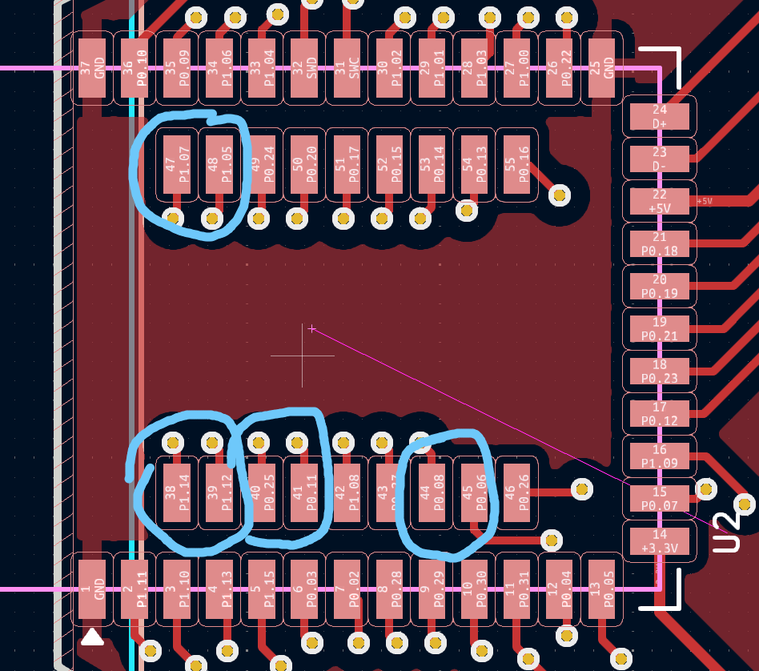
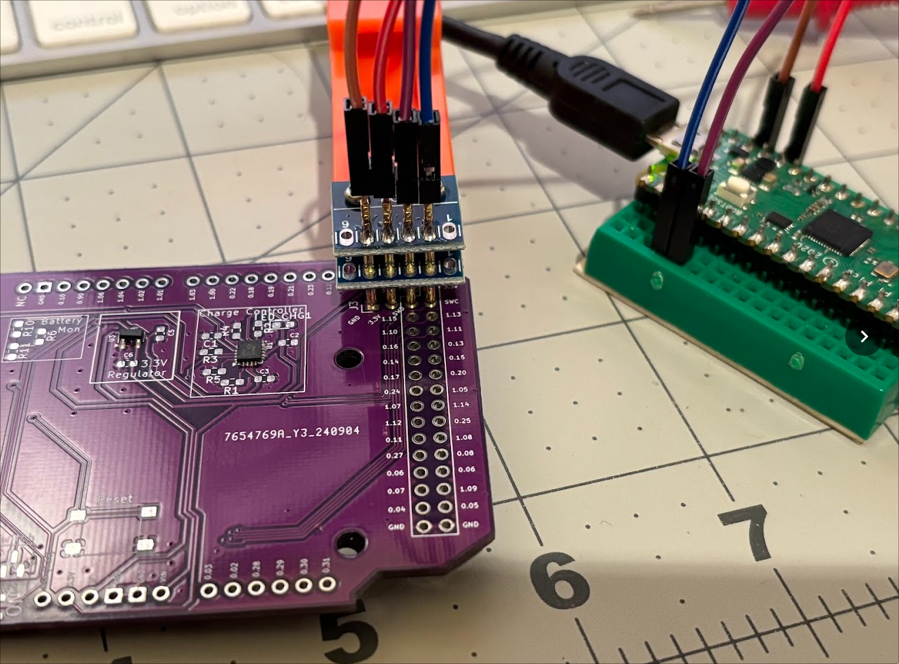
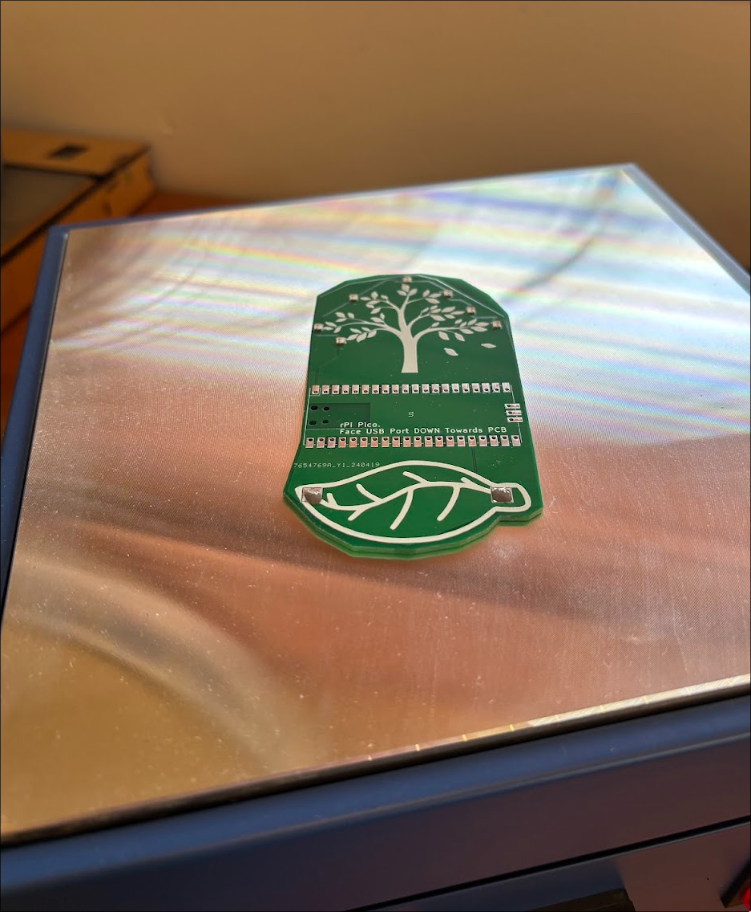
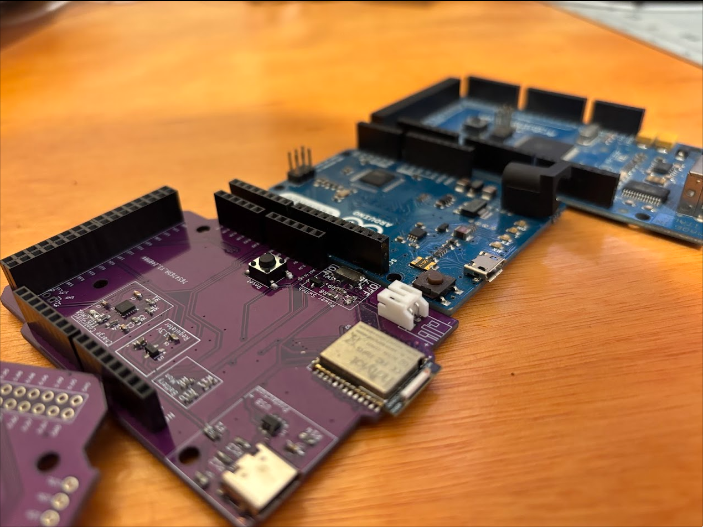
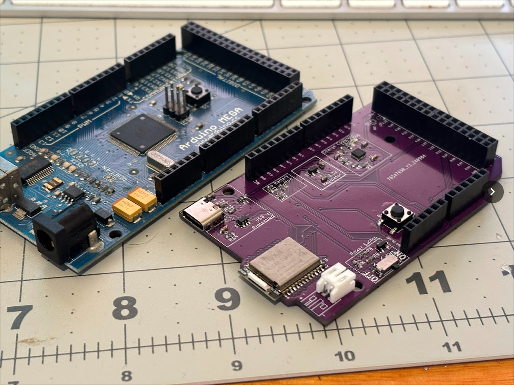
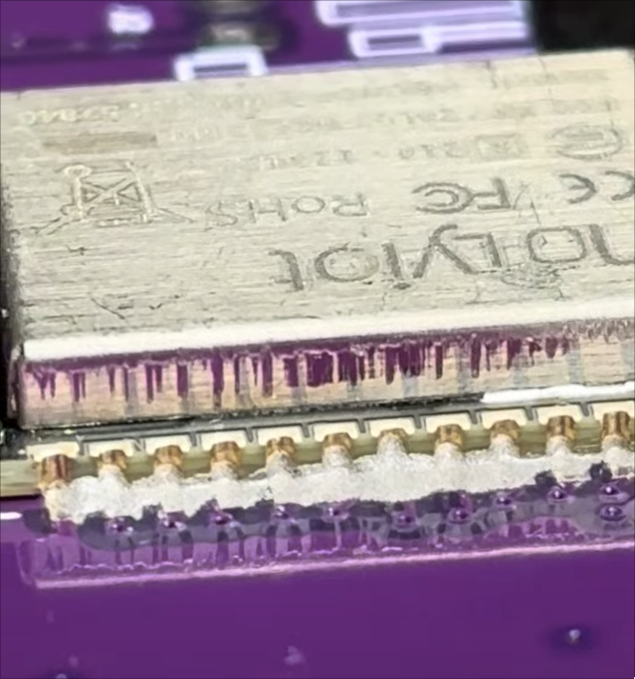
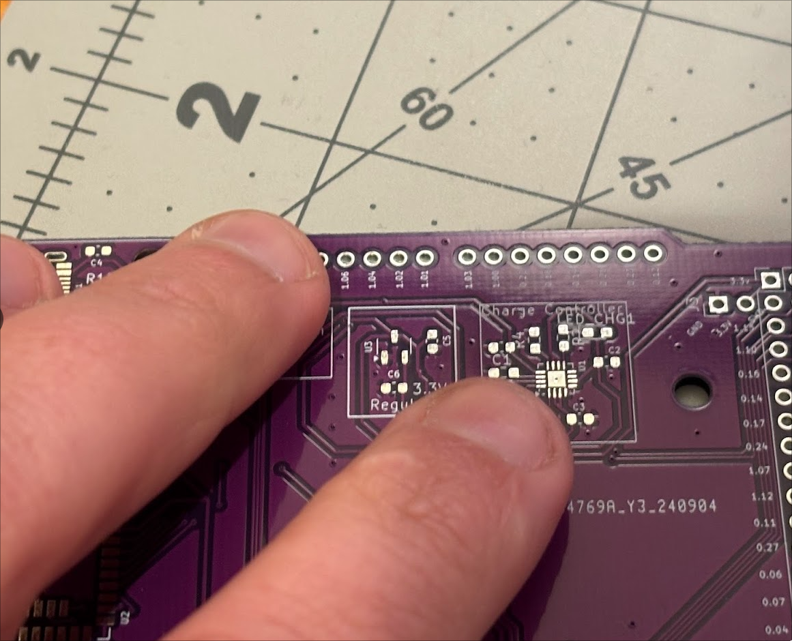
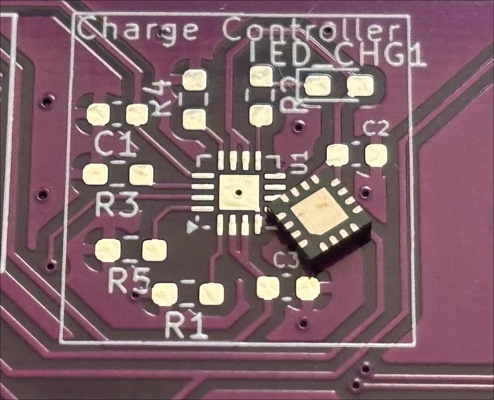

My [Previous Post](/post/2024-08-08-nrf52840-devboard/) was about building my very own
nRF52 dev board to play with!  For Christmas I got an electronic hot plate, so this post
is going to be documenting my foray into assembling, checking, and programming the board.

The board is up on [Github here](https://github.com/scottyob/nrf52840-uno)
{/* --- */}

## First attempt

I found it took a few attempts to get right.  I had placed a tiny dob of solder on each pad, by transferring it
from a pile of solder onto the board using a leg of a sacrificial LED, but when I was attempting to get
my makeshift programmer working (see programming below), it was timing out.  I managed to fix this with 
a little bit of extra solder on the edge, but, I was worried about dry joints here.


## Second attempt - bridged connections

Checking for continuity by putting my multimeter in continuinity mode and dragging up and down the 
lines of pines exposed without power shows that I have a number of bridged pads on the underside.
I guess I needed a lot less solder here.


*Adjacent pads are often bridged*


## Programming

Programming was done via a Rpi Pico I've got lying around using [Debugprobe](https://github.com/raspberrypi/debugprobe).  This is different from JTAG and instead uses SMD for programming and debugging.


*Pogo Pins used for flashing*

1. Download the debugprobe firmware.  Hold down the boot button and connect to the computer, upload to pico.
2. Install OpenOCD.  ```sudo dnf install openocd```

We can now test the connection to our nRF52 if the soldering went ok
```
[scott@sob-desktop Adafruit_Adalink]$ openocd -f interface/cmsis-dap.cfg -f target/nrf52.cfg -c "init"
Open On-Chip Debugger 0.12.0
Licensed under GNU GPL v2
For bug reports, read
	http://openocd.org/doc/doxygen/bugs.html
Info : auto-selecting first available session transport "swd". To override use 'transport select <transport>'.
Info : Using CMSIS-DAPv2 interface with VID:PID=0x2e8a:0x000c, serial=E66130100F7FA32B
Info : CMSIS-DAP: SWD supported
Info : CMSIS-DAP: Atomic commands supported
Info : CMSIS-DAP: Test domain timer supported
Info : CMSIS-DAP: FW Version = 2.0.0
Info : CMSIS-DAP: Interface Initialised (SWD)
Info : SWCLK/TCK = 0 SWDIO/TMS = 0 TDI = 0 TDO = 0 nTRST = 0 nRESET = 0
Info : CMSIS-DAP: Interface ready
Info : clock speed 1000 kHz
Info : SWD DPIDR 0x2ba01477
Info : [nrf52.cpu] Cortex-M4 r0p1 processor detected
Info : [nrf52.cpu] target has 6 breakpoints, 4 watchpoints
Info : starting gdb server for nrf52.cpu on 3333
Info : Listening on port 3333 for gdb connections
Info : Listening on port 6666 for tcl connections
Info : Listening on port 4444 for telnet connections

(seperate terminal)
(env) [scott@sob-desktop local-scott]$ telnet localhost 4444
Trying ::1...
telnet: connect to address ::1: Connection refused
Trying 127.0.0.1...
Connected to localhost.
Escape character is '^]'.
Open On-Chip Debugger
> nrf5 info
nRF52840-xxAA(build code: D0) 1024kB Flash, 256kB RAM
```

## Testing with PlatformIO

Once I was reasonably happy that I didn't have any bridged connections, I wanted to test that I didn't have any dry joints.  I did this using PlatformIO to create a small Zephyr program to turn all the IO pints HIGH.  Something was up with Arduino, as I couldn't get any IO pins on the GPIO1 register high (with pin numbers greater than 31).

Platformio.ini:
```
[env:nrf52840_dk_adafruit]
platform = nordicnrf52
board = nrf52840_dk
board_build.variant = Generic

framework = zephyr
upload_protocol = cmsis-dap
```

zephyr/prj.conf:
```
CONFIG_GPIO=y
CONFIG_SERIAL=n
```

main.c
```cpp
#include <zephyr.h>
#include <device.h>
#include <devicetree.h>
#include <drivers/gpio.h>

#define SLEEP_TIME_MS 1000

void main(void)
{
  const struct device *dev;
  int ret;
  uint32_t pin;

  // Iterate through all the GPIO pins (assuming 0-31 for example)
  for (pin = 0; pin < 32; pin++)
  {
    dev = device_get_binding(DT_LABEL(DT_NODELABEL(gpio0))); // Replace gpio0 if needed for your specific board
    if (dev == NULL)
    {
      return;
    }

    // Configure each pin as an output
    ret = gpio_pin_configure(dev, pin, GPIO_OUTPUT_ACTIVE);
    if (ret < 0)
    {
      return;
    }

    // Set the pin to high (on)
    gpio_pin_set(dev, pin, 1);
  }

  // Iterate through all the GPIO pins (assuming 0-31 for example)
  for (pin = 0; pin < 16; pin++)
  {
    dev = device_get_binding(DT_LABEL(DT_NODELABEL(gpio1))); // Replace gpio0 if needed for your specific board
    if (dev == NULL)
    {
      return;
    }

    // Configure each pin as an output
    ret = gpio_pin_configure(dev, pin, GPIO_OUTPUT_ACTIVE);
    if (ret < 0)
    {
      return;
    }

    // Set the pin to high (on)
    gpio_pin_set(dev, pin, 1);
  }

  // Keep the pins on
  while (1)
  {
    k_msleep(SLEEP_TIME_MS);
  }
}
```

Without trying to build a custom board for the Arduino SDK, I was unable to use any of the "Port1" register Ports (should be mapped to P1.00 for pin 32, P1.01 for 33 and so on.)

## Flashing the bootloader

I connected the SMD pogo pins, then followed [this guide](https://github.com/joric/nrfmicro/wiki/Bootloader)

```
openocd -f interface/cmsis-dap.cfg -f target/nrf52.cfg

(new window)
telnet localhost 4444
halt
nrf5 mass_erase
flash write_image pca10056_bootloader-0.2.11_s140_6.1.1.hex
flash verify_image pca10056_bootloader-0.2.11_s140_6.1.1.hex
reset run
```

This worked great, When I plugged in the USB port, it came up as a mass storage device!

The reset and programming button also worked well with a double tap sending it into mass storage device mode ready for new hardware.

## Programming with Arduino

To program with the Arduino, I had to select the board and the bootloader:

```
Adafruit mRF52 -> Nordic nRF52840 DK (ours is similar to this)
Tools -> Programmer -> Bootloader DFU
Burn Bootloader
```

Once this was done, a sample sketch just worked! (but only with the 0.xx pins... more time needed to check there) 


## Testing Current Draw

One of the use-cases I had for these chips was to be a simple standby BLE wakeup device.  To sit in a deep sleep, and once a command is received, be able to wake up a companion chip (like ESP32) by putting a pin HIGH.

I put a (very) simple Arduino sketch on the board to test sleeping, looping some number crunching, and doing some BLE RXing.  My findings are:

**Pin flip/flopping:** Flip flopping or *blinking* an IO pin caused only about 25uA of current drawn.  It wasn't even enough to be registered by the bench power supply and I needed to put my multimeter in series with it.  Turns out that after flip flopping the state, the arduino "delay" puts the chip into a sleep mode.

**Number Crunching**: Incrementing a counter without any delays drew roughly 6mA

**BLE Wakeup**:  This one is interesting, and certainly requires more time to look into this at a lower level.  The chip used peak of ~8mA when actively doing BLE RX/TX, but, was able to perform 2 second delays() just fine, and seemed to sleep at 200-300uA for a while, then settle on around 30uA.  I'm sure there are more peaks that I don't have a device to measure, but, this would be perfect for any use-cases I can think of, with battery life being measured in months.


*Multimeter shows BLE sketch using ~30uA typically*

**ChatGPT Designed Test Sketch**:
```cpp
#include <Arduino.h>
#include <Adafruit_TinyUSB.h> // for Serial
#include <bluefruit.h>

#define LED_PIN 4
#define BATTERY_PIN 31

BLEUart bleUart;

void setup() {
  pinMode(LED_PIN, OUTPUT);
  Serial.begin(115200);
  
  pinMode(BATTERY_PIN, INPUT);
  analogReadResolution(12);

  // Initialize BLE
  Bluefruit.begin();
  Bluefruit.setName("nRF52840 Light Sleep Demo");

  bleUart.begin();
  startAdv();
}

void loop() {
  if (bleUart.available()) {
    String cmd = bleUart.readStringUntil('\n');
    cmd.trim();

    if (cmd.equalsIgnoreCase("ON")) {
      digitalWrite(LED_PIN, HIGH);
      bleUart.println("LED ON");
    } 
    else if (cmd.equalsIgnoreCase("OFF")) {
      digitalWrite(LED_PIN, LOW);
      bleUart.println("LED OFF");
    }
  } else {
    char buf[10];
    auto val = analogRead(BATTERY_PIN);
    sprintf(buf, "%d", val);
    Serial.println(val);
    bleUart.print(buf);

    delay(2000);  // If no BLE connection, enter deep sleep
  }
}

// Function to start BLE advertising (low power settings)
void startAdv() {
  Bluefruit.Advertising.addFlags(BLE_GAP_ADV_FLAGS_LE_ONLY_GENERAL_DISC_MODE);
  Bluefruit.Advertising.addService(bleUart);
  Bluefruit.Advertising.restartOnDisconnect(true);
  Bluefruit.Advertising.setInterval(160, 3200); // Longer intervals = lower power
  Bluefruit.Advertising.start(0); // Start advertising indefinitely
}
```

As a bonus, we can also see the voltage divider working to send values (close to 3.3V max) for the battery voltage. 

## Lessons learned

* All batteries are not standard for polarity.  I needed to put my connector on back the front to re-purpose some of the "Leaf" batteries for testing
* The magic of flux!  This worked so much better for the underside pins on the 4th or so soldering attempt!
* Pretty sure on my first dev-board, I have soldered the wrong resistors into the charge controller.  Want to double check that!  I'm seeing a flashing status light, indicating my safety timers are wrong.


## Gallery of the Project


*Testing out my SMD soldering skills using a sacrificial test-board I had lying around*


*My nRF52-Mega next to various Arduino's*


*My nRF52-Mega next to an Arduino Mega I have around*


*Soldering the Holyiot nRF52 module using liquid solder*


*Shows the size of the components on the board*


*First time working with small SMD components.  Change controller shown here*

