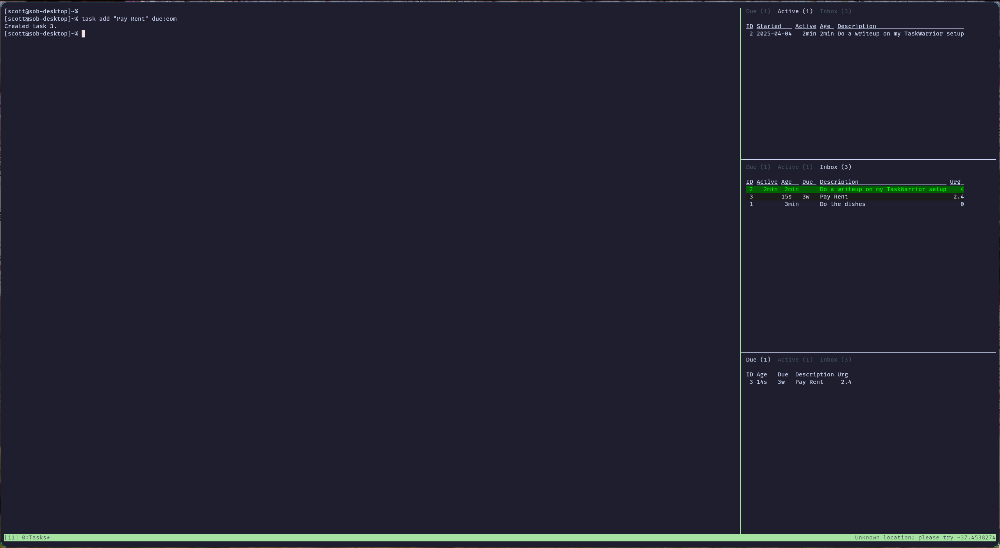
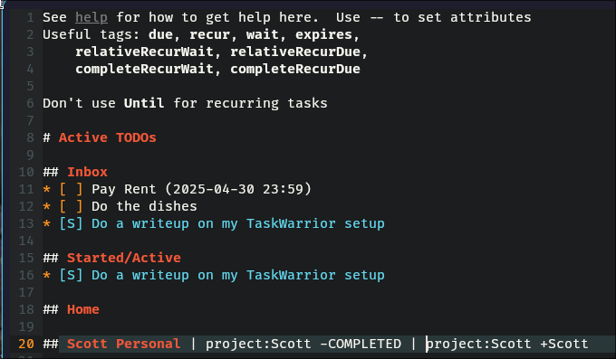
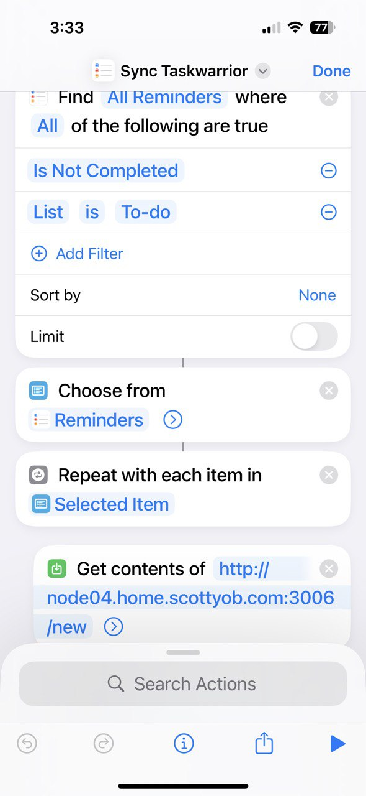
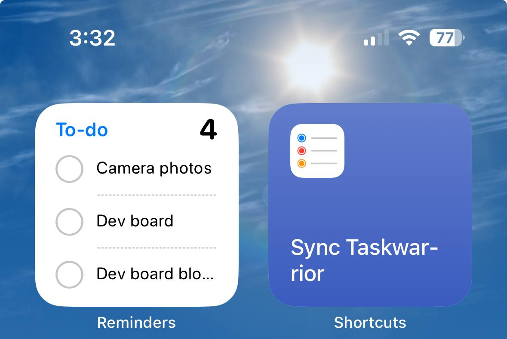
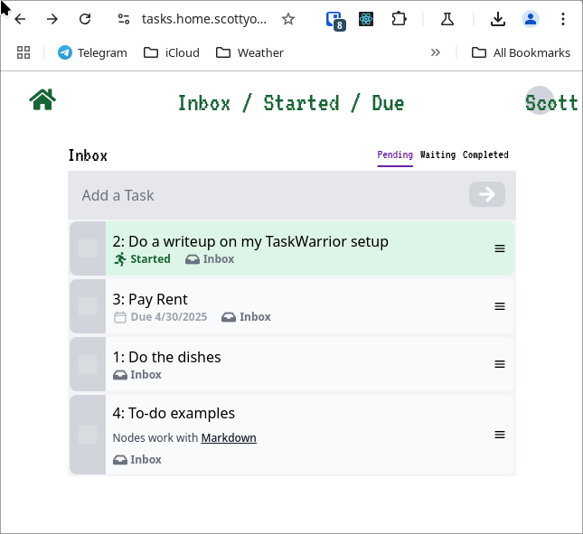

I use [TaskWarrior](https://taskwarrior.org/) to manage my tasks. It is a command-line task manager that is very powerful and flexible.  As I have heavily customized my TaskWarrior setup, 
I thought I would share some of the things I have done to make it work for me and the software I built around it to make it more useful in my workflows and daily life.

{/* --- */}

## A Quick Intro

TaskWarrior is a CLI tool.  The ```task``` command is used to create and manage tasks.  See below for a quick example of creating and managing tasks.

```
[scott@sob-desktop]~%
[scott@sob-desktop]~% task add "Do the dishes"
Created task 1.
[scott@sob-desktop]~% task add "Do a writeup on my TaskWarrior setup"
Created task 2.
[scott@sob-desktop]~% task start 2
Starting task 2 'Do a writeup on my TaskWarrior setup'.
Started 1 task.
[scott@sob-desktop]~%
[scott@sob-desktop]~% task

ID Active Age   Description                          Urg
 2   5s   10s   Do a writeup on my TaskWarrior setup    4
 1        28s   Do the dishes                           0

2 tasks
[scott@sob-desktop]~%
```

## CLI Dashboards

My workflow heavily uses tmux.  I have used [Tmux Resurrect](https://github.com/tmux-plugins/tmux-resurrect) to save and restore my tmux sessions and ensure that "ctrl b + r" will restore my task dashboard.  
On the right, I write my first little Rust program to display in tabs tasks that are in my "inbox", "Active" tasks I've started and am currently working on, and "Due".  
Tasks that need completion by certain dates.  I make heavy use of the "wait" attribute to keep tasks that are not yet ready to be started, or that I can defer from my lists.

You can find my [Taskwarrior Summary program Here](https://github.com/scottyob/taskwarrior-summary)

My tmux.conf config has the following to make this work with Resurrect:
```config
## TMUX Resurrect
set -g @plugin 'tmux-plugins/tmux-resurrect'
set -g @resurrect-processes '"~tasks-dash_active" "~tasks-dash_due" "taskwarrior-summary"'
```


*Tasks due soon in the side of my tmux window*


## Working with Lists

For quick and dirty upcoming tasks, my "inbox" method works pretty well.  For anything more detailed, I like to move my tasks into various projects and keep them out of my tmux summary pages.  I still
find NeoVim the easiest method to be keeping track of my tasks here.

I'm using a ~/wiki home directory, and using the [TaskWiki](https://github.com/tools-life/taskwiki) plugin for integrating with Vim.  That way, if I'm working on a project, I can tend to just open
that project's wiki page to see a list of the outstanding tasks.


*Vim showing task list integration*


## Integration with iPhone ToDo lists.

I am living in the 21st century, and do have a smartphone.  I don't tend to use a terminal emulator much on my phone and do make use of Siri when I'm driving.  I want things like "Add demonstrate Siri to my todo list"
to appear in my Taskwarrior Inbox.  I've not found a fantastic way to do this just yet, but I find with a shortcut, I can show my "iPhone todos" on my home screen, and have a button to move them into TaskWarrior.

A little bit more about my home setup now.  I use an NFS server for my home directory, with the .task directory shared on my desktop, and small servers running various docker containers.  My ansible playbook for
my TaskWarrior HTTP server looks like this:

```yaml
[scott@sob-desktop]~% cat Documents/sob-ansible/roles/taskwarrior/tasks/main.yml
- name: Start the Taskwarrior HTTP API Server
  docker_container:
    name: taskwarrior_rest
    image: scottyob/taskwarrior-simple-rest
    pull: true
    state: started
    restart_policy: unless-stopped
    volumes:
      - "/home/scott/.taskrc:/home/taskwarrior/.taskrc"
      - "/home/scott/.task:/home/scott/.task"
    ports:
      - '3006:9090'
    env:
      TZ: "America/Los_Angeles"
```

This [very, very simple Rust HTTP API](https://github.com/scottyob/taskwarrior-simple-rest) provides a way to get and create new tasks.  I just ensure my Tailscale is running on my phone if I want to access this from yonder.

[This shortcut](https://www.icloud.com/shortcuts/fa6bf709785745b281bf08402962c0af) will ask you for every task in my "ToDo" list and ask to create them in TaskWarrior (then delete from the iPhone list).

<div class="max-w-sm m-auto">

*iPhone shortcut in the shortcut app*
</div>


*My list of ToDo's and shortcut link on my homescreen*


## More advanced recurring tasks

I tend to make heavy use of recurring tasks.  Things like "Take out the trash", "Do the Dishes".  You can find my ["Better Recur"](https://github.com/scottyob/taskwarrior-better-recur/) scripts here
to help with this.  Some examples:

#### Relative Recur
You shouldn't mow your lawn more than once a week, but want to keep it short, so shouldn't wait for more than two weeks:

```bash
task add 'Mow the Lawn' relativeRecurWait:1weeks relativeRecurDue:2weeks
```

#### Expiring Recurring Task
The bins need to go out every week at Sunday, but, if you missed them by 10am, then the truck has probably already come, and you can try again the next week

```bash
task add 'Take the bins out' due:Monday wait:due-1d recur:weekly expires:10h
```

#### Wait and due On Complete
The dishes need to be done every night, once they're done (completed), we'll want to schedule it for tomorrow. You can always push this task off to stop it from re-firing


```bash
task add 'Do the dishes' completeRecurWait:"tomorrow +17hours" completeRecurDue:"tomorrow +1day"
```

## Web Interface

Lastly, is the desire to easily look at all of my tasks and manage them from either my web browser or mobile shortcut.  I write a web frontend called "Family Tasks" for this.
This little web app has changed a bit over time, but is now backed my TaskWarrior, with the TaskWarrior 2.6 binary installed within this NodeJS's docker container.  It's a bit
janky, but it works well for me for now!

This app is exposed via Traefik with a Google o-auth middleware to make sure nobody can access it but me and my wife :)

```yaml
[scott@sob-desktop]~% cat Documents/sob-ansible/roles/familytasks/tasks/main.yml
---
- name: Start the family tasks server
  docker_container:
    name: family_tasks
    image: scottyob/family-tasks
    pull: true
    state: started
    restart_policy: unless-stopped
    volumes:
      - "/docker/{{ inventory_hostname }}/tasks:/app/db"
      - "/home/scott/.taskrc:/.taskrc"
      - "/home/scott/.task:/home/scott/.task"
    ports:
      - '3002:3000'
    env:
      DATABASE_URL: "file:./db/db.sqlite"
      TZ: "America/Los_Angeles"
[scott@sob-desktop]~%
```


*Family Tasks web interface*
