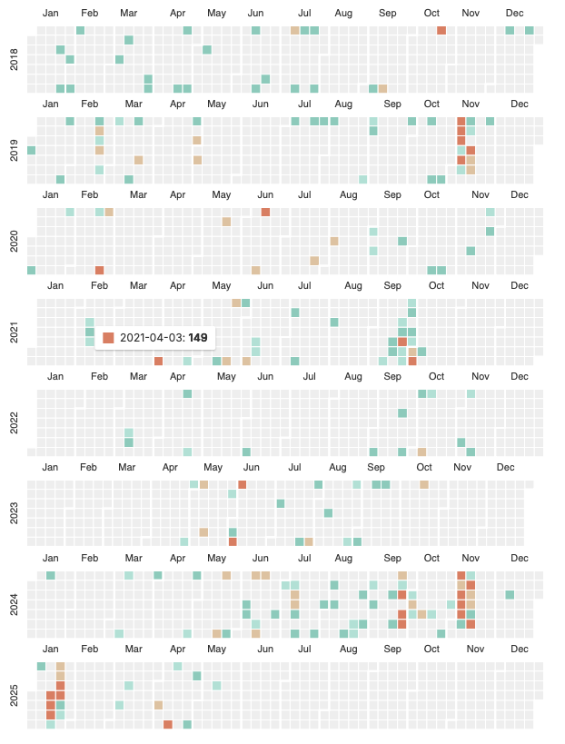
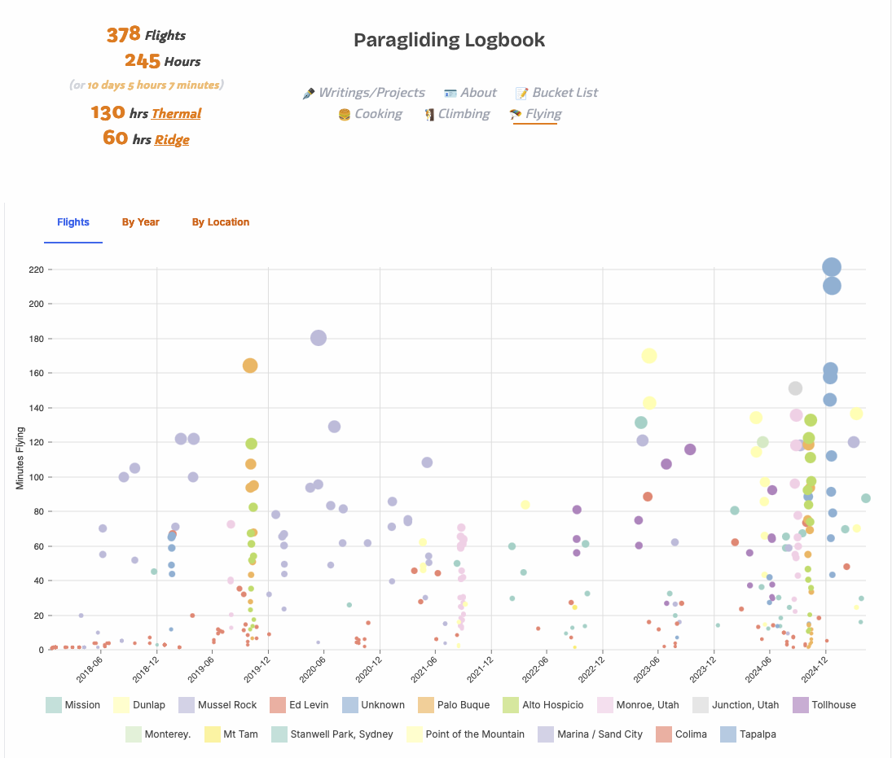
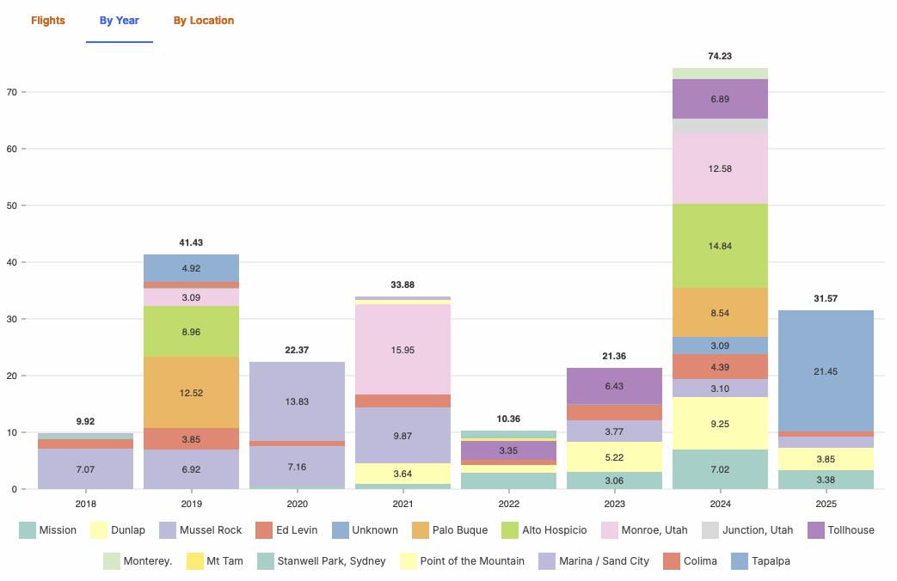
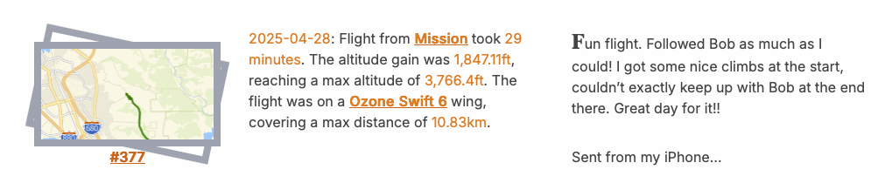
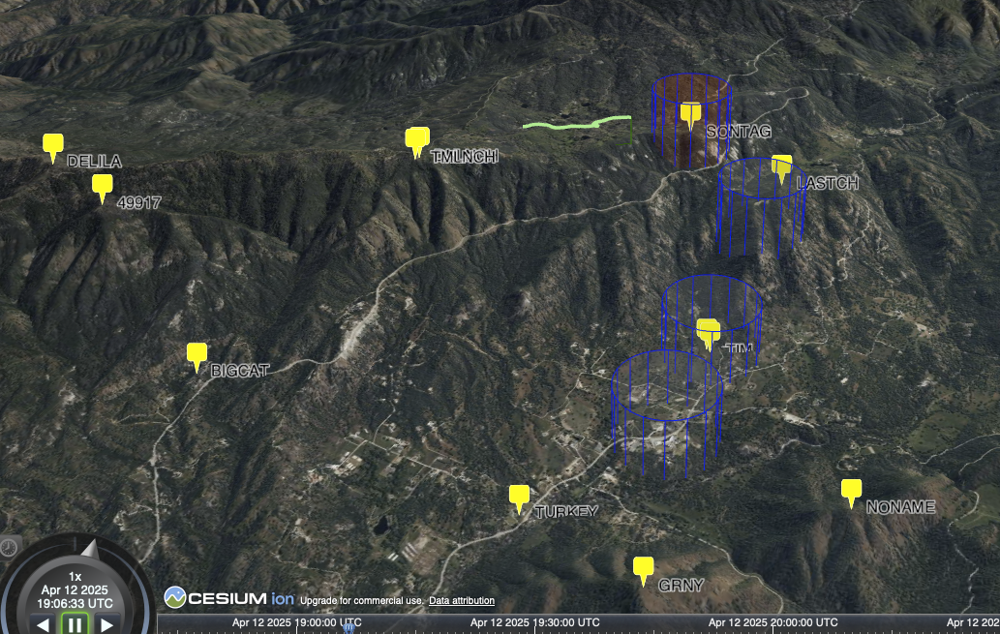

I've often been asked about how the [Logbook](/flying/) section of my website works.  My answer is as simple as

> I e-mail the track-log to myself, and it appears on my site a couple of minutes later.

This post documents how I've setup my website to keep track of my logbook, and present my flights
and data in an easy to consume format.

{/* --- */}

The website (in it's current incarnation) is built using the [Astro Framework.](https://astro.build) 
and hosted for free on Github Pages.  I was [previously using NextJS](/post/nextjs-website/) 
but found it built far too slow and wanted to give Astro a try.

To understand how my flight logs are published, I'll run over the pipeline from e-mailing my tracklog
to myself, to, it appearing on the website.


*Diagram of pipeline from e-mail to Github Pages*


## E-Mail of IGC files.

To upload a new flight, I simply e-mail the .igc tracklog file to myself, with the body of the e-mail the markdown
I want to use for my flight's writeup. 

This part is done by using Cloudflare to manage my e-mails.  You can see that the MX records for my domain
point to Cloudflare.

```
scott@Bethanys-MacBook-Air ~ % dig MX scottyob.com

; <<>> DiG 9.10.6 <<>> MX scottyob.com
;; global options: +cmd
;; Got answer:
;; ->>HEADER<<- opcode: QUERY, status: NOERROR, id: 38598
;; flags: qr rd ra; QUERY: 1, ANSWER: 3, AUTHORITY: 0, ADDITIONAL: 1

;; OPT PSEUDOSECTION:
; EDNS: version: 0, flags:; udp: 512
;; QUESTION SECTION:
;scottyob.com.			IN	MX

;; ANSWER SECTION:
scottyob.com.		300	IN	MX	65 route2.mx.cloudflare.net.
scottyob.com.		300	IN	MX	83 route1.mx.cloudflare.net.
scottyob.com.		300	IN	MX	12 route3.mx.cloudflare.net.

;; Query time: 30 msec
;; SERVER: 2001:558:feed::1#53(2001:558:feed::1)
;; WHEN: Mon Jun 09 20:33:02 PDT 2025
;; MSG SIZE  rcvd: 127
```

Once the e-mail reaches a logbook destination, [my Cloudflare Worker](https://github.com/scottyob/igc-email-publisher)
is kicked off to first upload it to [SportsTrackLive](https://www.sportstracklive.com) (you'll need an API key from them),
then extract the igc file from the e-mail body, 
[upload two blobs and a commit](https://github.com/scottyob/igc-email-publisher/blob/main/src/lib.mjs#L28-L62) to my 
[flight log github repo](https://github.com/scottyob/paragliding-logbook).

While this code is a bit hap hazard, it's easy enough to modify or move things to variabels if you want to re-use it,
but, it's been doing the job for me for the past two and a bit years so far!


## Manually Tracking Flights

If I've forgot to turn on my vario, or, I'm just playing with kiting, I'll often just update a 
[Google Sheets spreadsheet](https://docs.google.com/spreadsheets/d/1-rd2b-_l5IgavBxVe50O817AjAbI5qAVc0leU2bxUM8/edit?usp=sharing)
by hand with my flight details to be pulled down and embedded the next time the website is built.


## Building the Website

I'm making use of Astro's static site builds, such that my site can just be hosted on Github pages without the need for
any database backends, or servers handling requests for this simple site.

My website can be found separate from my logbook in [this github repo](https://github.com/scottyob/scottyob-astro).

You can find a [Github actions deployment script](https://github.com/scottyob/scottyob-astro/blob/main/.github/workflows/deploy.yml)
responsible for:
1.  Initializing the Git submodule for my flight logs and ensuring they're on the latest.
2.  Issues an Astro Build to build static pages for my site.
3.  Deploys the built artifacts to Github Pages.


### Under the hood

You can see how individual flight replays are created using [thus slug](https://github.com/scottyob/scottyob-astro/blob/main/src/pages/flying/flight/%5Bid%5D.astro)

You can use [this as a good starting point](https://github.com/scottyob/scottyob-astro/blob/61cd2e31243a91fb8fd5278f0c7642c21e3aeeae/src/libs/flying.ts#L276-L287)
to see how my flights are fetched from the igc repo, and from google sheets to be merged on the site.


### Seeing my logbook in actions

I'm pretty happy with how this came out, so, I'll share some nice photos of what my logbook is capable of.


*A Github style calendar view showing days I flew, and for how long that day*


*Scatterplot of flights, and their duration.*


*Bar graphs of flights by year, and location*


*Flight Summary shows brief overview of flight*


*Flight replayer shows a 3D replay of flight, waypoints if task flying, and points of interest*


So there you have it.  My website and flight replaying, all on static pages, not relying on any third party services that I can't
easy replace!  And everything you see on my site is open source and can be taken and used as you see fit! :)

Check it out at [https://www.scottyob.com/flying](https://www.scottyob.com/flying)

And if you liked this, you may also be interested in the [Tasks Checker](/post/2021-09-20-para-tasks) from a long while back.