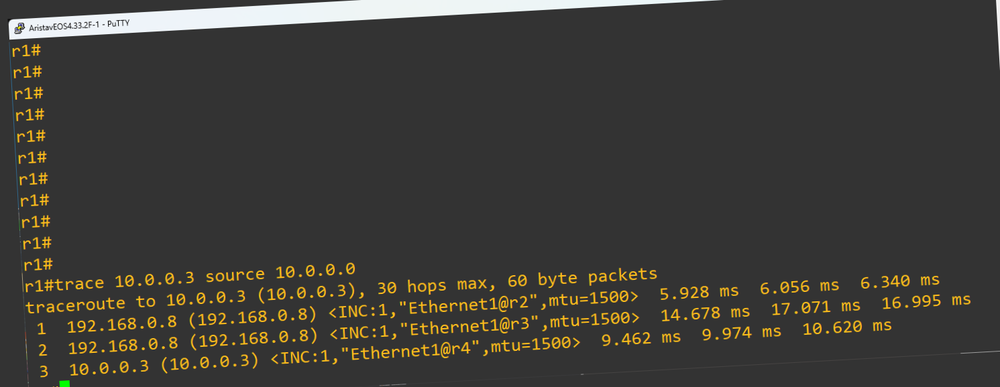

import animation from "./animation.json.lottie";
import LottieAnimation from "astro-integration-lottie/Lottie.astro";
import v6core from "./v6-core.svg"


You're building out more of your infrastructure without IPv4, but, you still want to allow IPv4 packets to traverse your IPv6 infrastructure.
What's more, You want to enable debuggability like IPv4 Traceroute to continue working as you deploy V6 only parts of your network.  This blog post
runs over how we achieved just this at a previous position I was working for!

{/* --- */}

Before we talk about how this traceroute works, let's look at the business requirement.  In a previous job, we were deploying
a large number of data centers.  There were lots of different designs now coming out to support various topologies.
Previously, we were deploying IPv4 with RFC1918 addresses in a "re-usable" fashion. We would make *device1.building1.region1* 
have the exact same IPv4 interconnects and loopbacks as *device1.building1.region2*.  You could derive the regions in your traceroutes due
to the DC edge devices having unique addresses, so, debuggability with trace routes was not an issue with re-using addresses.

As more and more buildings and regions were getting turned up that look *different*, this approach no longer worked.  The simple solution is just to
deploy our infrastructure without **any** IPv4 addresses, in either the interconnects, OR the loopbacks.  This works for services 
as we can use things like [RFC8950](https://datatracker.ietf.org/doc/html/rfc8950)
to allow web servers, DNS servers, proxy servers and long tail of hosts that need a global IPv4 presence to advertise their unique V4 addresses.
When something goes wrong, and your typical network engineer wants to fall back to the tools they know like traceroute, then what?

The rest of this post will do a quick recap of how Traceroute works, and, how ICMP Extension Headers can be used to keep traceroute useful, WITHOUT having
unique addresses along the infrastructure.

## A quick recap of Traceroute.

When a device is performing a IPv4 traceroute, IP packets (typically UDP or ICMP Echo Requests) are sent to the destination with TTLs starting at 1, then incrementing
with each new hop along the path that's discovered.

<LottieAnimation src={animation} />
<p class="text-center italic">animation showing a traceroute to discover the 2nd hop</p>

The response the nodes give along the path is an IPv4 Packet with an ICMP Type 11 "time-to-live" exceeded.  Historically, the routers that are sending
the ICMP TTL Exceeded messages will also include the "Internet Header + 64 bits of Data Datagram", so that the sender's kernel can direct the response
back to the correct application.

## Removing IPv4 from infra

I like [this writeup from Ivan](https://blog.ipspace.net/2024/03/arista-interface-ebgp/) on how to use BGP sessions on IPv6 Link-Local addresses (commonly referred to Unnumbered
addresses), then how to use RFC8950 to be able to send IPv4 prefixes over this infrastructure.  This works great, and will not break the reachability across out network.


### What about Traceroute?

For traceroute to continue working, we still need to generate ICMP Type 11, ttl-exceeded messages, and, they need to be encapsulated in an IPv4 Packet.  If the routers
in this infra have IPv4 addresses on their loopbacks, they should be used.  In a large-scale environment, or, one where no IPv4 at all was allocated, there may not be an IPv4 address
on the loopback!  The BGP Router-ID may be some incrementing ID in a database.  It only needs to be unique per ASN!

So what *should* the source address be in this case?  It *could* be 192.168.0.8 (*IANA reserved "IPv4 dummy address", RFC7600*) or perhaps an anycast address (resolving to v6-deprecated-here.someorg.com).

But then, the last problem.  The traceroute client would start seeing lots of this same address showing up, and would not help resolve any issues in a traceroute.


## ICMP Extension Headers

To help identify devices along the path, we can use ICMP Extension Headers!  RFC4884 modifies the requirement to send the "Internet Header + 64 bits of Data Datagram", to instead
allow us to carry extension headers and extension objects.  This is commonly used, as you can see on hop 5 to show MPLS labels to Google's DNS servers.


*Traceroute often shows MPLS labels*

[rfc5837](https://datatracker.ietf.org/doc/html/rfc5837) has been around since 2010 to add interface identification to this, but as my previous employer was just starting to make use of this, we're just
now starting to see adoption in network operating systems (including FBOSS, [shameless plug](https://github.com/facebook/fboss/commit/f898646026937540f6ca5174df7997e85e52e61a))

This now let's us add interface names.  In the case of FBOSS, we're also able to put the device hostname on there too, as "The interface name MAY be some other human-meaningful name of the interface."
according to the RFC.

This functionality was [added into Traceroute 2.1.4](https://sourceforge.net/projects/traceroute/files/traceroute/traceroute%202.1.4/) too!  So may already be sitting on your Linux workstation :)

This information could also be useful for other areas too, like identifying the physical interface in a bundle that would have been used had it been forwardable.

## On Arista

Arista added the functionality in 4.33.0, for all devices **except** cEOS.  Spinning up a little lab in my good old trusty GNS3, you can see how this traceroute looks.


*Traceroute through v6 only autonomous systems*

Example Config:
```
r3#show run
! Command: show running-config
! device: r3 (vEOS-lab, EOS-4.34.2F)
!
! boot system flash:/vEOS-lab.swi
!
hostname r3
!
interface Ethernet1
   no switchport
   ipv6 enable
!
interface Ethernet2
   no switchport
   ipv6 enable
!
interface Loopback0
   ip address 192.168.0.8/32
!
ip routing ipv6 interfaces
!
ipv6 unicast-routing
!
router bgp 65002
   router-id 0.0.0.3
   no bgp default ipv4-unicast
   neighbor ebgp peer group
   neighbor interface Et1 peer-group ebgp remote-as 65001
   neighbor interface Et2 peer-group ebgp remote-as 65003
   !
   address-family ipv4
      neighbor ebgp activate
      neighbor ebgp next-hop address-family ipv6 originate
!
router general
   icmp error extensions
      params include hostname
   !
   vrf default
      icmp error extensions
         extensions
!
router multicast
   ipv4
      software-forwarding kernel
   !
   ipv6
      software-forwarding kernel
!
end
r3#

```