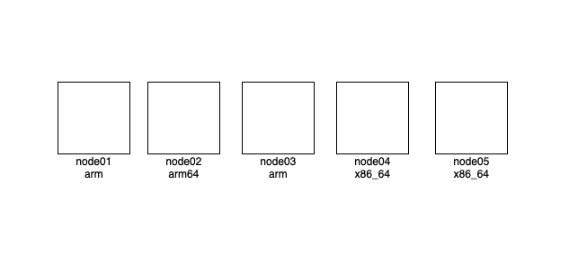
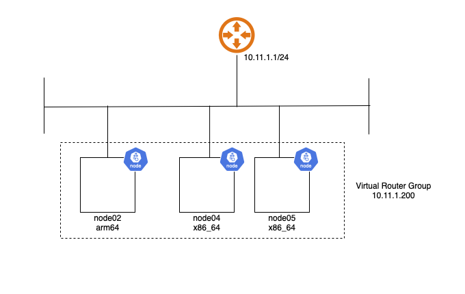

As with the last post, a job I'm looking at requires Kubernetes experience.
This page is for documenting my efforts for setting up Kubernetes in my home network for something
practical, deploying a Telegram bot to monitor Garmin inReach satellite trackers for paragliding
competitions to forward messages to an entire group.

This page will be on my learnings, and notes for setting up my K8s cluster!

{/* --- */}

At Facebook, we had Twine (internally still called Tupperware) to manage our jobs.  I've managed to
avoid touching Kubernetes for the past decade, so, a lot of catching up is required.  I had previously
tried running my jobs in a HA platform by using Docker Swarm, mostly across Raspberry Pi's, with 
GlusterFS used across my nodes SD Cards for a reliable persistent storage.  At times, the IO wait was
in the order of seconds, and, it didn't take me very long to rip that out.

I have probably over-corrected now.  I have a few machines, but the only ones of real use for compute
power are the rPi5 with 8GB of RAM, and two gifted x86_64 machines.  I run Ansible across these machines,
and my playbooks deploy any jobs that I want on one machine.  Any persistent storage is stored locally to that
node, with hourly rsync cronjobs setup to back them up.  In the event of a hardware failure, I'd just modify
my ansible to bring up the containers on a different node.



The new goal is to go back to having highly available setup, this time with Kubernetes.  To get used to 
more of the terms and configuration options, and slowly move my apps from being deployed on Docker to 
being in my Kubernetes cluster.  I'll only use the nodes with 8GB of RAM for this experiment.

## Setting up Kubernetes

### Requirements
* Dual stack, each container needs to able to access the IPv6 internet
* Needs to host web services under home.scottyob.com 
* Needs to be highly available.  Any node can fail.


### Network Container Interface
* I'm using IPv6 DHVPv6 PD to get my prefixes from my ISP.  
* There's no guarantees of keeping the same subnets after a power outage, so I intend to use 
  IPv6 unique-local addresses within my cluster.  I intend to NAT outgoing connections on the pods to 
  reach the public internet.

As Flannel does not support doing IPv6 NAT, to keep this simple so I won't have to manage externally,
I'm going to use Calico.  My [Calico config](https://gist.github.com/scottyob/d6f19bc971952886316b9e272b547cb6) 
uses a private RFC1918 IPv4 subnet, and an IPv6 Unique Local Address (ULA) to ensure NAT outbound connections
are made.

This also has the side effect of using a VXLAN encapsulation if inter-pod traffic was to traverse different
subnets on the host.


### Control Plane

I'm starting by setting up the virtual address, which should take up priority on node05


*VRRP Address will float among all nodes*

Each of these three nodes will be control nodes, "untained" then so they can also schedule compute
jobs on them.


### Ansible
I'll move my Ansible secrets out and make my repo public one of these days.  In the mean time, the task basically:
* Creates the k8s apt repos
* loads kernel modules for overlay and netfilter
* ensured ip forwarding is set
* Sets up containerd to use default configs, ensuring SystemdCgroup is set to true
* Installs Kubernetes
* Sets up the Kubelet config to use a different resolv.conf (I had a wildcards DNS record used on my search domain)

### Creating the cluster

1. Create my [cluster configs](https://gist.github.com/scottyob/d6f19bc971952886316b9e272b547cb6) files

2. Initialize k8s, and apply the Calico resources
```bash
$ sudo kubeadm init --config ./kubeadm.conf
$ kubectl create -f https://raw.githubusercontent.com/projectcalico/calico/v3.30.3/manifests/tigera-operator.yaml
$ kubectl apply -f ./custom-resources.yaml
```

3. Generate a cert key to allow other nodes to join (secrets modified)
```
[scott@node05 k8s]$ sudo kubeadm init phase upload-certs --upload-certs
[upload-certs] Storing the certificates in Secret "kubeadm-certs" in the "kube-system" Namespace
[upload-certs] Using certificate key:
2384902384903242
[scott@node05 k8s]$ kubeadm token create --print-join-command --certificate-key 2384902384903242
kubeadm join 10.11.1.200:6443 --token jc3ltn.8xelqcilixymd0h2 --discovery-token-ca-cert-hash sha256:237893247823478293478923 --control-plane --certificate-key 2384902384903242
[scott@node05 k8s]$
```

4. Run the given kubeadm command on new nodes

5. Untaint the nodes so workloads can be scheduled on them
```
kubectl taint nodes --all node-role.kubernetes.io/control-plane-
```

### Starting again
If we want to blow everything away, and, start again.
```
sudo kubeadm reset -f
sudo systemctl stop kubelet
sudo systemctl stop containerd
sudo rm -rf /etc/cni/net.d /var/lib/cni/ /var/lib/kubelet/* /etc/kubernetes/ /var/lib/etcd
sudo systemctl start containerd

sudo ctr -n k8s.io containers list -q | xargs -r -n1 sudo ctr -n k8s.io containers delete
sudo ctr -n k8s.io images list -q | xargs -r -n1 sudo ctr -n k8s.io images rm

rm -Rf $HOME/.kube
```

## Useful Commands

```
kubectl get all,nodes -A
[scott@node05 k8s]$ kubectl get all,nodes -A
NAMESPACE          NAME                                          READY   STATUS    RESTARTS      AGE
calico-apiserver   pod/calico-apiserver-595d48b4b9-5gp6t         1/1     Running   0             3h39m
calico-apiserver   pod/calico-apiserver-595d48b4b9-t8zn9         1/1     Running   0             3h39m
calico-system      pod/calico-kube-controllers-7c85cdbf5-hs79p   1/1     Running   0             3h39m
calico-system      pod/calico-node-dcs2z                         1/1     Running   3 (53m ago)   94m
calico-system      pod/calico-node-jktwp                         1/1     Running   0             3h39m
calico-system      pod/calico-node-zdznf                         1/1     Running   0             3h27m
calico-system      pod/calico-typha-869596b6df-684jl             1/1     Running   0             3h39m
calico-system      pod/calico-typha-869596b6df-qrztz             1/1     Running   3 (53m ago)   94m
calico-system      pod/csi-node-driver-7wtpl                     2/2     Running   0             3h39m
calico-system      pod/csi-node-driver-f42kr                     2/2     Running   6 (53m ago)   94m
calico-system      pod/csi-node-driver-zfcbm                     2/2     Running   0             3h27m
calico-system      pod/goldmane-68c899b75-ltwdn                  1/1     Running   0             3h39m
calico-system      pod/whisker-57bfbf8454-h9cgx                  2/2     Running   0             3h39m
kube-system        pod/coredns-66bc5c9577-ghxkr                  1/1     Running   0             3h40m
kube-system        pod/coredns-66bc5c9577-t78qq                  1/1     Running   0             3h40m
kube-system        pod/etcd-node02                               1/1     Running   3 (53m ago)   93m
kube-system        pod/etcd-node04                               1/1     Running   1             3h27m
kube-system        pod/etcd-node05                               1/1     Running   0             3h40m
kube-system        pod/kube-apiserver-node02                     1/1     Running   4 (53m ago)   93m
kube-system        pod/kube-apiserver-node04                     1/1     Running   11            3h27m
kube-system        pod/kube-apiserver-node05                     1/1     Running   0             3h40m
kube-system        pod/kube-controller-manager-node02            1/1     Running   3 (53m ago)   93m
kube-system        pod/kube-controller-manager-node04            1/1     Running   2             3h27m
kube-system        pod/kube-controller-manager-node05            1/1     Running   0             3h40m
kube-system        pod/kube-proxy-77bsq                          1/1     Running   0             3h40m
kube-system        pod/kube-proxy-p8g58                          1/1     Running   3 (53m ago)   94m
kube-system        pod/kube-proxy-qphqt                          1/1     Running   0             3h27m
kube-system        pod/kube-scheduler-node02                     1/1     Running   3 (53m ago)   93m
kube-system        pod/kube-scheduler-node04                     1/1     Running   2             3h27m
kube-system        pod/kube-scheduler-node05                     1/1     Running   0             3h40m
tigera-operator    pod/tigera-operator-db78d5bd4-2pjg8           1/1     Running   0             3h40m

NAMESPACE          NAME                                      TYPE        CLUSTER-IP       EXTERNAL-IP   PORT(S)                  AGE
calico-apiserver   service/calico-api                        ClusterIP   10.100.73.102    <none>        443/TCP                  3h39m
calico-system      service/calico-kube-controllers-metrics   ClusterIP   None             <none>        9094/TCP                 3h38m
calico-system      service/calico-typha                      ClusterIP   10.110.48.196    <none>        5473/TCP                 3h39m
calico-system      service/goldmane                          ClusterIP   10.105.198.118   <none>        7443/TCP                 3h39m
calico-system      service/whisker                           ClusterIP   10.96.255.181    <none>        8081/TCP                 3h39m
default            service/kubernetes                        ClusterIP   10.96.0.1        <none>        443/TCP                  3h40m
kube-system        service/kube-dns                          ClusterIP   10.96.0.10       <none>        53/UDP,53/TCP,9153/TCP   3h40m

NAMESPACE       NAME                             DESIRED   CURRENT   READY   UP-TO-DATE   AVAILABLE   NODE SELECTOR            AGE
calico-system   daemonset.apps/calico-node       3         3         3       3            3           kubernetes.io/os=linux   3h39m
calico-system   daemonset.apps/csi-node-driver   3         3         3       3            3           kubernetes.io/os=linux   3h39m
kube-system     daemonset.apps/kube-proxy        3         3         3       3            3           kubernetes.io/os=linux   3h40m

NAMESPACE          NAME                                      READY   UP-TO-DATE   AVAILABLE   AGE
calico-apiserver   deployment.apps/calico-apiserver          2/2     2            2           3h39m
calico-system      deployment.apps/calico-kube-controllers   1/1     1            1           3h39m
calico-system      deployment.apps/calico-typha              2/2     2            2           3h39m
calico-system      deployment.apps/goldmane                  1/1     1            1           3h39m
calico-system      deployment.apps/whisker                   1/1     1            1           3h39m
kube-system        deployment.apps/coredns                   2/2     2            2           3h40m
tigera-operator    deployment.apps/tigera-operator           1/1     1            1           3h40m

NAMESPACE          NAME                                                DESIRED   CURRENT   READY   AGE
calico-apiserver   replicaset.apps/calico-apiserver-595d48b4b9         2         2         2       3h39m
calico-system      replicaset.apps/calico-kube-controllers-7c85cdbf5   1         1         1       3h39m
calico-system      replicaset.apps/calico-typha-869596b6df             2         2         2       3h39m
calico-system      replicaset.apps/goldmane-68c899b75                  1         1         1       3h39m
calico-system      replicaset.apps/whisker-57bfbf8454                  1         1         1       3h39m
calico-system      replicaset.apps/whisker-66f55fc78c                  0         0         0       3h39m
calico-system      replicaset.apps/whisker-76944599f8                  0         0         0       3h39m
kube-system        replicaset.apps/coredns-66bc5c9577                  2         2         2       3h40m
tigera-operator    replicaset.apps/tigera-operator-db78d5bd4           1         1         1       3h40m

NAMESPACE   NAME          STATUS   ROLES           AGE     VERSION
            node/node02   Ready    control-plane   94m     v1.34.0
            node/node04   Ready    control-plane   3h27m   v1.34.0
            node/node05   Ready    control-plane   3h40m   v1.34.1
[scott@node05 k8s]$
```
*Gets all namespaces pods, deployments, nodes*

## Key Terms

* *CRI* Container Runtime Interface:  Interface to allow Kubernetes agent (kubelet, runs on local host) to 
  talk to a runtime.  This can be things like docker (with a shim) or containerd
* *CTL* ctr tools (or nerdctl for docker like syntax) are just CLI tools to manage the runtime (containerd).
* *CNI* Container Network Interface. Used to create networks, setup environment for forwarding between pods.
* *Kube-Proxy* container that runs on every node enable communication between services.
    * When kubernetes uses a service (abstraction for a set of pods), proxy will ensure that a client talks to a
      service IP.  Request is routed to one of the healthy pods backing service.
    * Adds routes to ensure that communication can occur.
    * Supports operating modes
        * ipvs: Load-balancer in the kernel
        * iptables: Simple to route traffic.
