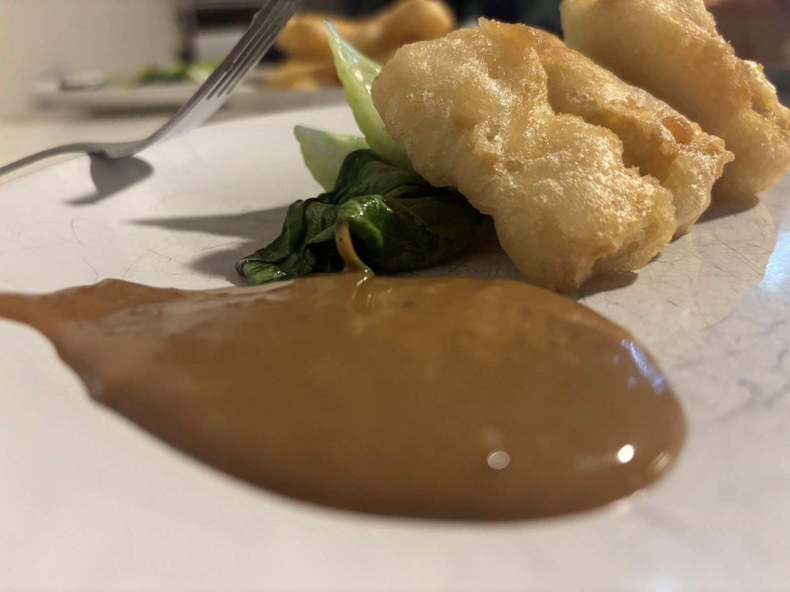

*With [Peanut Butter Sauce](/recipe/peanut-butter-sauce/)*

This one came from [FoodHighs](https://www.foodhighs.com/2015/10/08/tempura-tofu-vegan/)

NOTE:  I did freeze, and it came out great.

NOTE:  I used baking powder.  Have not yet tried with bakind soda.

## Ingredients
* 1 block (about 14 oz) extra‑firm or firm tofu (pressed; optional: frozen & thawed for a chewier texture)
* ½ cup rice flour (or use ¼ cup rice + ¼ cup all‑purpose flour)
* ½ cup all‑purpose flour
* ¾ teaspoon baking soda (or baking powder)
* ¼ teaspoon salt
* club soda (about 1 cup, kept refrigerated)
* Oil for frying (vegetable, peanut, or other neutral high‑smoke‑point oil)

## Method
1. **Prep your tofu** – Press (and optionally freeze overnight, then thaw) the tofu to remove excess moisture, then cut into bite‑sized strips or cubes.
2. **Heat the oil** – Prepare enough oil in a pot or skillet to cover the tofu pieces, and heat it while you prepare the batter.
3. **Make the batter** – In a bowl, whisk together the dry ingredients (rice flour, all‑purpose flour, salt, and baking soda). Pour in cold club soda and stir—lumpy batter is fine.  Don't over stir.
4. **Fry in batches** – Dip tofu pieces in the batter, then carefully place them into the hot oil. Fry for about 2 minutes until crispy and golden, then remove and drain on paper towels or a rack.
5. **Serve immediately** – Enjoy hot, with soy sauce, ponzu, curry, or dipping sauce of choice.  I used [Peanut Butter Sauce](/recipe/peanut-butter-sauce/)
